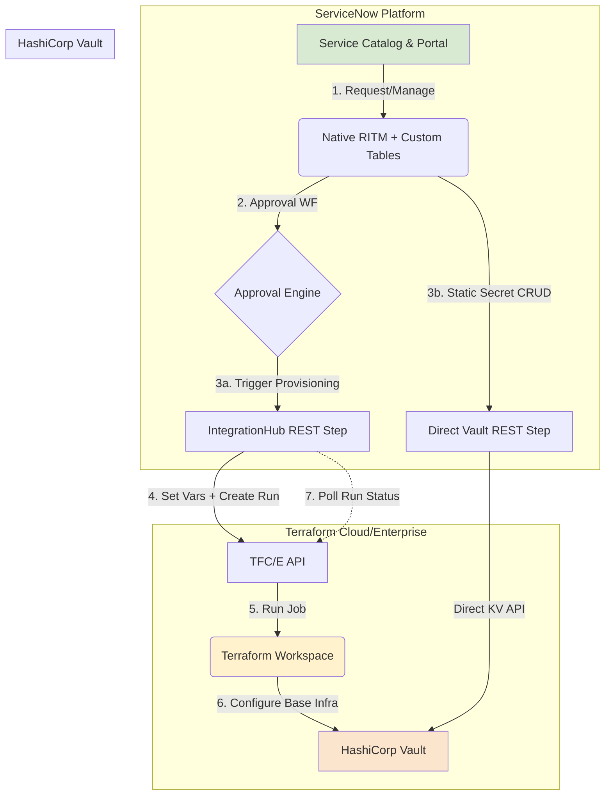
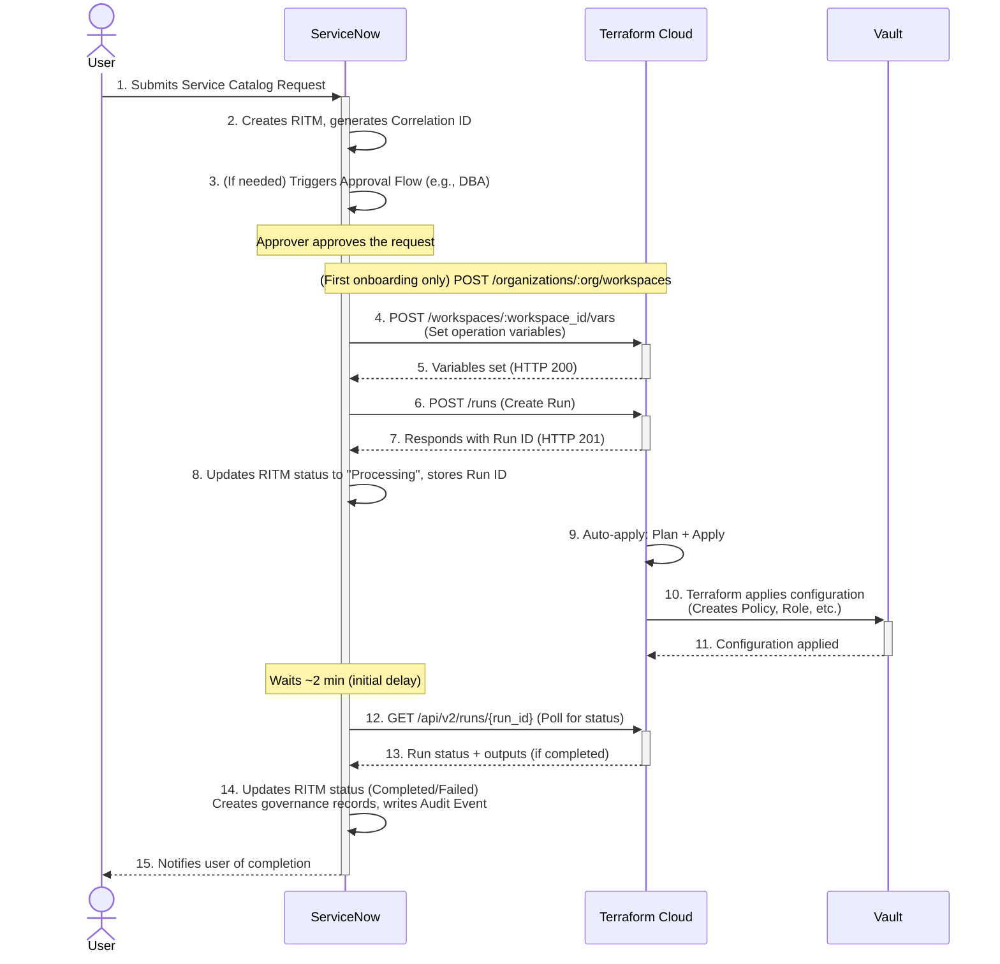
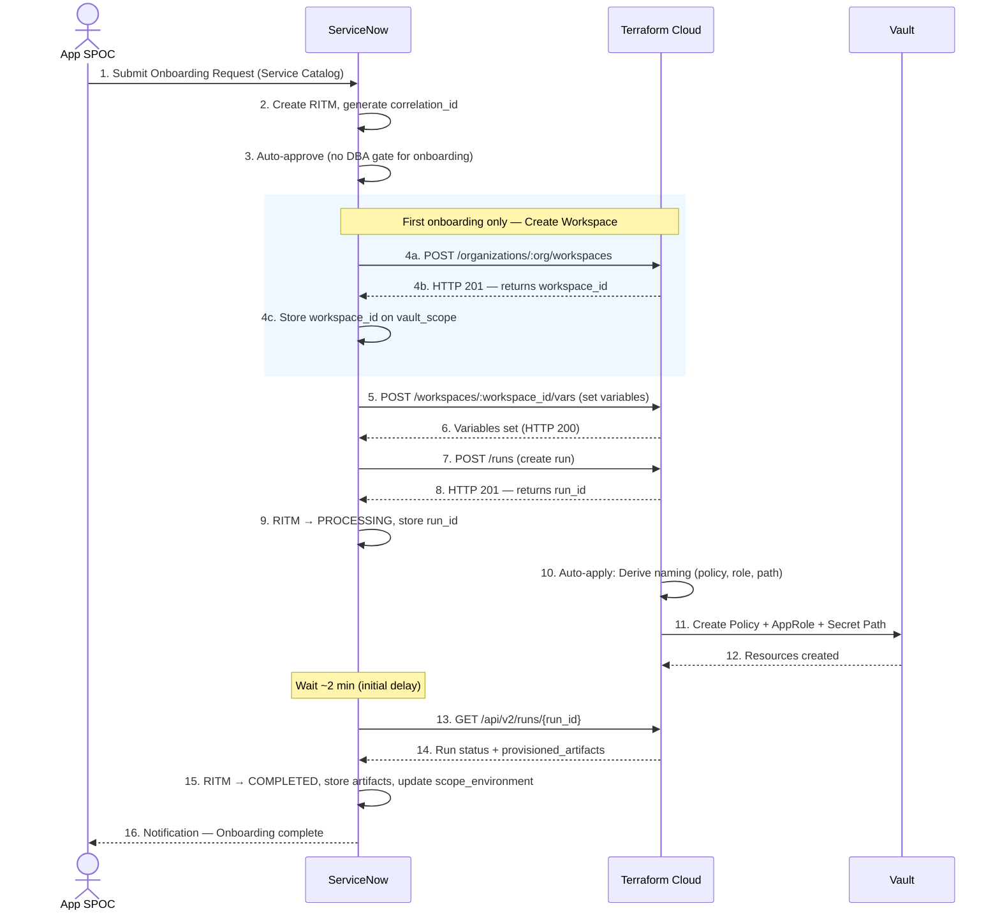
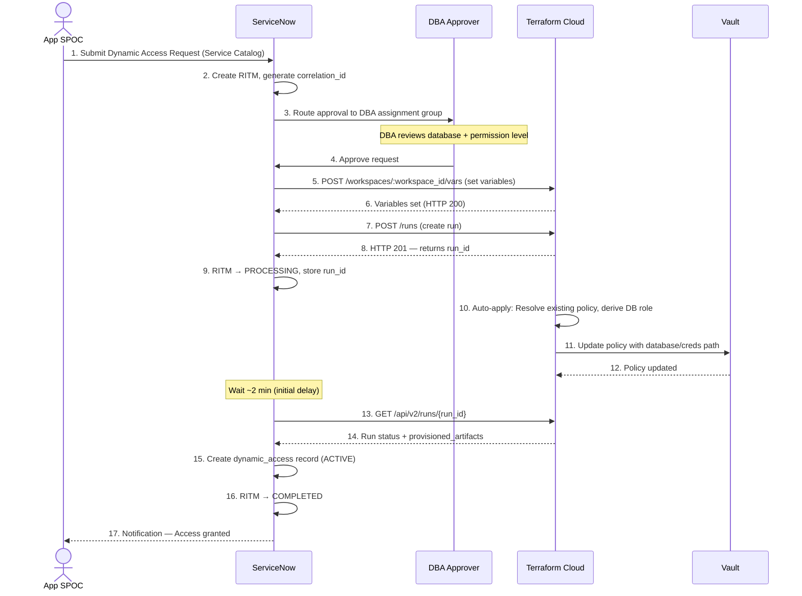
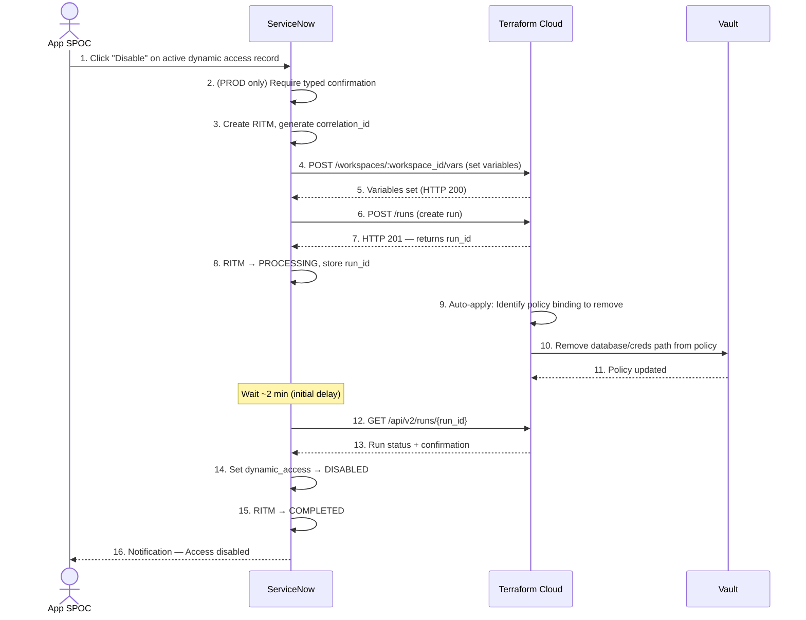

# Architecture & Integration Design (AID): ServiceNow, Terraform, and HashiCorp Vault Integration

**Version:** 1.5 (Uniqueness Key & Telecom Examples)  
**Date:** 9 April 2026  
**Status:** APPROVED  
**Supersedes:** v1.4

**Authors:**
-   **ServiceNow Architect**
-   **Terraform Architect**
-   **Vault Architect**

---

## 1. Introduction & Vision

This document outlines the architecture and design for integrating ServiceNow with HashiCorp Terraform and Vault. The primary goal is to create a self-service portal within ServiceNow that enables application teams to securely manage secrets and access resources provisioned by Terraform, governed by ServiceNow workflows, with all secrets managed by HashiCorp Vault.

This integration empowers developers with velocity while providing a robust, auditable, and secure governance framework for enterprise secrets management.

### 1.1. Key Design Principles

The architecture is founded on three core principles:

1.  **ServiceNow as the "Single Pane of Glass":** All user-facing requests for Vault resources (onboarding, access requests) originate from the ServiceNow Service Catalog. It is the system of engagement and governance.
2.  **Terraform as the Primary Provisioning Engine:** All configuration changes in Vault (policies, roles, paths, database mounts) are executed through Terraform Cloud/Enterprise. This ensures infrastructure as code (IaC) best practices, repeatability, and a clear audit trail. 
    *   **Exception:** Static Secret Management (CRUD operations on key-value pairs) interacts directly with the Vault API from ServiceNow to prevent secrets from ever entering Terraform state files (Epic 2).
3.  **Vault as the System of Truth for Secrets:** Vault is the central, authoritative source for all secrets. ServiceNow will **never** store or have visibility into any secret values (passwords, tokens, keys). It only manages the metadata and lifecycle of those secrets.

### 1.2. System Responsibilities & Boundaries

| System | Role | Responsibilities | Explicit Non-Responsibilities |
|---|---|---|---|
| **ServiceNow** | System of Engagement & Governance | Service Catalog intake, user input validation (CMDB/iTap), approval workflows, request lifecycle (REQ/RITM), orchestration trigger (API calls), status tracking, audit and compliance tracking | Must NOT define infrastructure constructs (policies, paths, roles). Must NOT store or process secret values. |
| **Terraform** | System of Provisioning & Configuration Control | Vault policy creation/management, AppRole creation/configuration, secret path structure definition, database role/access configuration, enforcement of naming conventions, lifecycle management of Vault resources, maintaining infrastructure state | Must NOT expose implementation details to ServiceNow beyond what is needed for governance tracking. |
| **HashiCorp Vault** | System of Record for Secrets & Access Control | Secure storage of secrets, enforcement of access policies, dynamic credential generation, audit logging of all secret operations | — |

---

## 2. Integration Ground Rules

These 9 ground rules govern **every** API interaction between ServiceNow and Terraform. They are non-negotiable architectural constraints validated by the ARB. Violation of any rule must be flagged during code review.

### 2.1. Intent-Based Contracts

All API interactions from ServiceNow must be **intent-driven**, not implementation-driven.

ServiceNow sends:
- **What** needs to be done (e.g., onboard application, grant access)

ServiceNow does NOT send:
- **How** it should be implemented (e.g., policy names, paths, role names)

### 2.2. Minimal Payload Principle

API payloads from ServiceNow must contain only:
- **Identifiers** (e.g., `mots_id`, `database_name`)
- **Required business inputs** (e.g., `environment`, `permission_level`)
- **Correlation metadata** (e.g., `correlation_id`)

Payloads must NOT include:
- Derived values (e.g., `pol-dev-mots-1234`)
- Naming conventions
- Infrastructure configuration details

### 2.3. Terraform-Owned Configuration

All infrastructure-specific decisions are handled within Terraform, including:
- Naming conventions (policy names, role names)
- Vault path structures
- Policy definitions (HCL)
- Access patterns

ServiceNow must not replicate or duplicate this logic.

### 2.4. Loose Coupling

- Changes in Terraform implementation must not require changes in ServiceNow.
- ServiceNow remains independent of Vault internal structure.
- This is achieved by using abstract identifiers instead of concrete values and avoiding hardcoded paths or names in ServiceNow.

### 2.5. Idempotent Operations

All API operations must be designed to be **idempotent**:
- Repeated requests with the same input must not create duplicate resources.
- Terraform must safely handle retries without side effects.

### 2.6. Correlation and Traceability

Every request must include a **`correlation_id`** that is:
- Generated in ServiceNow (format: `req-uid-{uuid_short}`)
- Passed to Terraform in the outbound payload
- Present in Terraform run outputs (retrieved via polling)

This ID links: RITM records ↔ Terraform runs ↔ Vault operations ↔ Audit logs.

### 2.7. No Secret Exposure Principle

- ServiceNow must never receive, store, or log secret values.
- All secret operations must occur directly within Vault.
- Any UI interaction must be metadata-driven only.

### 2.8. Asynchronous Execution Model

Provisioning via Terraform follows an **asynchronous poll-based model** with a **two-step run pattern**:
1. ServiceNow sets workspace variables via `POST /api/v2/workspaces/:workspace_id/vars`.
2. ServiceNow creates a run via `POST /api/v2/runs` — the workspace has **auto-apply enabled**, so no separate apply step is required.
3. Terraform processes the request independently (plan + auto-apply).
4. ServiceNow polls the TFC Run API (`GET /api/v2/runs/{run_id}`) after an initial delay (~2 minutes) to retrieve run status and outputs.

For **first-time onboarding**, an additional preceding step creates the workspace via `POST /api/v2/organizations/:org_name/workspaces`.

ServiceNow must not block or wait synchronously for Terraform. Terraform does **not** call back to ServiceNow — ServiceNow is responsible for polling.

### 2.9. Error Handling Responsibility Split

| Owner | Handles |
|---|---|
| **Terraform** | Infrastructure-level failures (Vault API errors, state conflicts, provider errors) |
| **ServiceNow** | Workflow-level failures (poll response processing, user notifications, RITM state management) |

Error responses must be: structured, non-sensitive, and actionable.

---

## 3. Solution Architecture

### 3.1. Conceptual Diagram



### 3.2. Component Responsibilities

See **Section 1.2** for the full responsibility matrix including explicit non-responsibilities.

---

## 4. Data Model & Interaction Flow

### 4.1. Internal Data Models

Each system maintains its own internal data model. ServiceNow tracks request lifecycle, governance metadata, and audit events internally. Terraform maintains infrastructure state. Vault maintains secrets and access policies.

> Internal data model details are documented separately per team. The companion **ServiceNow Data Model v5.1** covers ServiceNow schemas.

### 4.2. Asynchronous Provisioning Flow (Terraform)

This is the primary pattern for application onboarding and dynamic database access provisioning. Every Terraform operation follows a **two-step run pattern**: (1) set workspace variables, then (2) create a run. Auto-apply is enabled on all workspaces, so no separate apply confirmation is required.



-   **Two-Step Run Pattern:** ServiceNow first sets all required variables on the workspace (`POST /workspaces/:workspace_id/vars`), then triggers a run (`POST /runs`). The run payload itself contains no variables — it only references the workspace.
-   **Auto-Apply:** All Terraform workspaces are configured with `auto-apply = true`. After a successful plan, Terraform automatically applies. No `POST /runs/:run_id/actions/apply` call is needed.
-   **Polling Model:** ServiceNow polls the Terraform Run API using the stored Run ID after an initial delay (`x_att2_vault.terraform_poll_start_after_minutes`, default: 2 minutes). Polling repeats every `x_att2_vault.terraform_poll_interval_minutes` (default: 2 minutes) until a terminal status is received or `terraform_max_wait_hours` is exceeded.

### 4.3. Terraform Workspace Strategy

-   A **single Terraform Workspace** will be created for each `x_att2_vault_scope` record (e.g., Application `MOTS-1234` or Sub-App `MOTS-1234-line-disconnect`).
-   The workspace manages *all environments* (DEV, TEST, PROD) for that specific scope.
-   The `Terraform Workspace ID` is stored in the `x_att2_vault_scope` table in ServiceNow, linking the application to its IaC definition.

#### Workspace Ownership Model

| Concern | Owner |
|---|---|
| Workspace naming convention | ServiceNow (follows pattern `vault-{mots_id}[-{sub_app}]`) |
| Workspace creation | ServiceNow (via `POST /api/v2/organizations/:org_name/workspaces` during first onboarding) |
| Auto-apply configuration | ServiceNow (set `auto-apply = true` at workspace creation) |
| Workspace ID storage | ServiceNow (`x_att2_vault_scope.u_terraform_workspace_id`) |
| Workspace reuse for subsequent operations | ServiceNow (passes `workspace_id`) + Terraform (validates) |

**Key Behaviour:**
- **First onboarding:** If `workspace_id` does not exist on the scope record → ServiceNow creates the workspace via the TFC API (`POST /api/v2/organizations/:org_name/workspaces`) with `auto-apply = true`, stores the returned `workspace_id`, then proceeds with set-variables + create-run.
- **Subsequent requests** (additional environments, dynamic access, disable): ServiceNow uses the stored `workspace_id` directly. No new workspace is created.

---

## 5. Key Integration Use Cases & Payloads

> **Payload Design Rule:** All outbound interactions follow a **two-step run pattern**: (1) set workspace variables via `POST /workspaces/:workspace_id/vars`, then (2) trigger a run via `POST /runs`. Variables follow Ground Rules 2.1–2.3: intent-based, minimal, business-identifiers only. Terraform derives all infrastructure specifics. For first-time onboarding, a preceding `POST /organizations/:org/workspaces` call creates the workspace. Workspaces have `auto-apply = true`, so no separate apply step is needed. Poll response payloads (retrieved by ServiceNow from TFC Run API) are minimal status responses with optional `provisioned_artifacts` for governance tracking.

### 5.1. Use Case 1: Application Onboarding

-   **Goal:** Provision Vault resources (AppRole, Policy, Secret Path) for a new application environment.
-   **Trigger:** Approved Service Catalog request in ServiceNow.
-   **Operation:** `ONBOARD_APPLICATION`

#### **Transaction Flow**



#### **Step 1 — Create Workspace (First Onboarding Only)**

If no `workspace_id` exists on the `x_att2_vault_scope` record, ServiceNow creates a new workspace before triggering any run.

**Endpoint:** `POST /api/v2/organizations/:org_name/workspaces`

```json
{
  "data": {
    "type": "workspaces",
    "attributes": {
      "name": "vault-mots-1234",
      "auto-apply": true
    }
  }
}
```

**Response (HTTP 201):** Returns the workspace `id` (e.g., `ws-abcdef123456`). ServiceNow stores this in `x_att2_vault_scope.u_terraform_workspace_id`.

| Field | Type | Required | Description |
|---|---|---|---|
| `name` | String | Yes | Workspace name — pattern: `vault-{mots_id}[-{sub_app}]` |
| `auto-apply` | Boolean | Yes | Always `true` — Terraform auto-applies after successful plan |

#### **Step 2 — Set Workspace Variables**

ServiceNow sets the operation variables on the workspace before creating the run. One API call per variable.

**Endpoint:** `POST /api/v2/workspaces/:workspace_id/vars`

**Parent Application — Variables:**

```json
[
  { "key": "operation",        "value": "ONBOARD_APPLICATION", "category": "terraform" },
  { "key": "correlation_id",   "value": "req-uid-8c9a2b3f",   "category": "terraform" },
  { "key": "mots_id",          "value": "MOTS1234",            "category": "terraform" },
  { "key": "application_name", "value": "network-services",    "category": "terraform" },
  { "key": "environment",      "value": "DEV",                 "category": "terraform" }
]
```

**Sub-Application — Additional Variable:**

```json
  { "key": "sub_application_name", "value": "line-disconnect", "category": "terraform" }
```

**Per-Variable API Payload Format:**

```json
{
  "data": {
    "type": "vars",
    "attributes": {
      "key": "operation",
      "value": "ONBOARD_APPLICATION",
      "category": "terraform",
      "hcl": false,
      "sensitive": false
    },
    "relationships": {
      "workspace": {
        "data": { "type": "workspaces", "id": "ws-abcdef123456" }
      }
    }
  }
}
```

#### **Step 3 — Create Run**

After variables are set, ServiceNow triggers the run. The run payload contains **no variables** — it references the workspace only.

**Endpoint:** `POST /api/v2/runs`

```json
{
  "data": {
    "type": "runs",
    "attributes": {
      "message": "ServiceNow Onboarding Request"
    },
    "relationships": {
      "workspace": {
        "data": { "type": "workspaces", "id": "ws-abcdef123456" }
      }
    }
  }
}
```

**Response (HTTP 201):** Returns the run `id` (e.g., `run-CKuwRhSg3x4gAbcd`). ServiceNow stores the Run ID on the request record.

> **Auto-Apply:** The workspace is configured with `auto-apply = true`. After a successful plan, Terraform automatically applies — no `POST /runs/:run_id/actions/apply` call is needed.

**Outbound Variable Field Reference:**

| Field | Type | Required | Description |
|---|---|---|---|
| `operation` | String | Yes | Operation intent: `ONBOARD_APPLICATION` |
| `correlation_id` | String | Yes | Unique request ID for end-to-end traceability (format: `req-uid-{uuid}`) |
| `mots_id` | String | Yes | Application identity from CMDB/iTap |
| `application_name` | String | Yes | Human-readable application name |
| `sub_application_name` | String | No | Logical sub-component name (only for sub-apps) |
| `environment` | String | Yes | Target environment: `DEV`, `TEST`, or `PROD` |

**What ServiceNow does NOT send** (per Ground Rules 2.1–2.3):
- ~~`vault_policy_name`~~ — Terraform derives this
- ~~`vault_approle_name`~~ — Terraform derives this
- ~~`secret_path`~~ — Terraform derives this

#### **Terraform Processing Responsibilities**

Upon run execution (auto-apply), Terraform must:
1. Read workspace variables set by ServiceNow.
2. **Derive and provision:** Vault policy, AppRole, and secret path structure — all per Terraform's naming convention.
3. Write run outputs (status, `provisioned_artifacts`) available via TFC Run API.

#### **Terraform Run Output — Poll Response (Onboarding)**

ServiceNow retrieves the run status and outputs by polling the TFC Run API after the initial delay.

**Endpoint:** `GET /api/v2/runs/{run_id}` (with optional `?include=run_outputs`)

**Success:**
```json
{
  "correlation_id": "req-uid-8c9a2b3f",
  "status": "COMPLETED",
  "run_id": "run-CKuwRhSg3x4gAbcd",
  "workspace_id": "ws-abcdef123456",
  "provisioned_artifacts": {
    "vault_approle_name": "role-dev-mots-1234",
    "vault_secret_path": "secret/data/org/dev/mots-1234",
    "vault_namespace": "admin/enterprise"
  }
}
```

**Poll Response Field Reference (Success):**

| Field | Type | Description |
|---|---|---|
| `correlation_id` | String | Original request ID — used to match back to RITM |
| `status` | String | `COMPLETED` or `FAILED` |
| `run_id` | String | Terraform run identifier for audit trail |
| `workspace_id` | String | Terraform workspace ID (persisted on first onboarding) |
| `provisioned_artifacts.vault_approle_name` | String | Created AppRole name — stored for governance display |
| `provisioned_artifacts.vault_secret_path` | String | Created secret mount path — stored for governance display |
| `provisioned_artifacts.vault_namespace` | String | Vault namespace used for this scope |

> **Architectural Decision:** The `provisioned_artifacts` block is Terraform *telling* ServiceNow what was created — not ServiceNow dictating what to create. This does not violate the intent-based principle because the data flows Terraform → ServiceNow (outputs), not ServiceNow → Terraform (instructions). These values are available as Terraform run outputs and retrieved during polling.

**Failure:**
```json
{
  "correlation_id": "req-uid-8c9a2b3f",
  "status": "FAILED",
  "run_id": "run-CKuwRhSg3x4gAbcd",
  "error": {
    "code": "ONBOARDING_FAILED",
    "message": "Vault policy creation failed due to permission issue"
  }
}
```

**Poll Response Field Reference (Failure):**

| Field | Type | Description |
|---|---|---|
| `correlation_id` | String | Original request ID |
| `status` | String | `FAILED` |
| `run_id` | String | Terraform run identifier |
| `error.code` | String | Machine-readable error code |
| `error.message` | String | Human-readable, non-sensitive error description |

#### **Idempotency Rules (Onboarding)**

- Multiple onboarding requests for the same `mots_id + sub_application + environment` must NOT create duplicate infrastructure.
- Terraform must detect existing resources and perform safe reconciliation.
- Repeated requests are treated as idempotent operations (Ground Rule 2.5).

---

### 5.2. Use Case 2: Dynamic Database Credential Access

-   **Goal:** Grant an application's AppRole access to a dynamic database role in Vault.
-   **Trigger:** DBA-approved Service Catalog request.
-   **Operation:** `GRANT_DB_ACCESS`

#### **Transaction Flow**



#### **Step 1 — Set Workspace Variables**

ServiceNow sets the operation variables on the existing workspace (created during onboarding).

**Endpoint:** `POST /api/v2/workspaces/:workspace_id/vars`

**Variables:**

```json
[
  { "key": "operation",        "value": "GRANT_DB_ACCESS",               "category": "terraform" },
  { "key": "correlation_id",   "value": "req-uid-4f2c8e1a",             "category": "terraform" },
  { "key": "mots_id",          "value": "MOTS1234",                     "category": "terraform" },
  { "key": "application_name", "value": "network-services",             "category": "terraform" },
  { "key": "sub_application_name", "value": "line-disconnect",          "category": "terraform" },
  { "key": "environment",      "value": "PROD",                         "category": "terraform" },
  { "key": "database_name",    "value": "subscriber-postgres-prod",     "category": "terraform" },
  { "key": "permission_level", "value": "READ_ONLY",                    "category": "terraform" }
]
```

#### **Step 2 — Create Run**

**Endpoint:** `POST /api/v2/runs`

```json
{
  "data": {
    "type": "runs",
    "attributes": {
      "message": "ServiceNow Dynamic Access Request"
    },
    "relationships": {
      "workspace": {
        "data": { "type": "workspaces", "id": "ws-abcdef123456" }
      }
    }
  }
}
```

> **Auto-Apply:** No separate apply step — workspace has `auto-apply = true`.

**Outbound Variable Field Reference:**

| Field | Type | Required | Description |
|---|---|---|---|
| `operation` | String | Yes | Operation intent: `GRANT_DB_ACCESS` |
| `correlation_id` | String | Yes | Unique request ID for end-to-end traceability |
| `mots_id` | String | Yes | Application identity from CMDB/iTap |
| `application_name` | String | Yes | Human-readable application name |
| `sub_application_name` | String | No | Logical sub-component (if applicable) |
| `environment` | String | Yes | Target environment: `DEV`, `TEST`, or `PROD` |
| `database_name` | String | Yes | Target database — CMDB reference name from the database registry |
| `permission_level` | String | Yes | Access level: `READ_ONLY` or `READ_WRITE` |

**What ServiceNow does NOT send:**
- ~~`app_policy_name`~~ — Terraform identifies the existing policy
- ~~`db_vault_mount`~~ — Terraform knows its own mounts
- ~~`db_role_name`~~ — Terraform derives this from database_name + permission_level

#### **Terraform Processing Responsibilities**

Upon auto-apply, Terraform must:
1. Identify existing application policy from `mots_id` + `sub_application_name` + `environment`.
2. Determine DB role name from `database_name` + `permission_level`.
3. Update policy to grant access to the dynamic database credentials path.
4. Ensure idempotency (repeated requests do NOT duplicate policy entries).
5. Write run outputs (status, `provisioned_artifacts`) available via TFC Run API.

#### **Terraform Run Output — Poll Response (Dynamic Access)**

ServiceNow retrieves the run status and outputs by polling the TFC Run API after the initial delay.

**Endpoint:** `GET /api/v2/runs/{run_id}` (with optional `?include=run_outputs`)

**Success:**
```json
{
  "correlation_id": "req-uid-4f2c8e1a",
  "status": "COMPLETED",
  "run_id": "run-Xk8mPq2wL9nReFgH",
  "workspace_id": "ws-abcdef123456",
  "provisioned_artifacts": {
    "vault_role_name": "subscriber-postgres-prod-readonly",
    "vault_credential_path": "database/creds/subscriber-postgres-prod-readonly"
  }
}
```

**Poll Response Field Reference (Success):**

| Field | Type | Description |
|---|---|---|
| `correlation_id` | String | Original request ID — used to match back to RITM |
| `status` | String | `COMPLETED` or `FAILED` |
| `run_id` | String | Terraform run identifier for audit trail |
| `workspace_id` | String | Terraform workspace ID |
| `provisioned_artifacts.vault_role_name` | String | Dynamic database role name in Vault — used for governance tracking |
| `provisioned_artifacts.vault_credential_path` | String | Path to generate dynamic credentials — used for governance tracking |

**Failure:**
```json
{
  "correlation_id": "req-uid-4f2c8e1a",
  "status": "FAILED",
  "run_id": "run-Xk8mPq2wL9nReFgH",
  "error": {
    "code": "DB_ACCESS_FAILED",
    "message": "Database role not found or policy update failed"
  }
}
```

#### **Idempotency Rules (Dynamic Access)**

- Multiple requests for the same `mots_id + sub_application_name + environment + database_name + permission_level` must NOT create duplicate policy entries.
- Policy updates are additive and safe.
- Existing access is not recreated.

---

### 5.3. Use Case 3: De-provisioning / Disabling Dynamic Access

-   **Goal:** Remove an application's dynamic database access by deleting the policy binding in Vault.
-   **Trigger:** Self-service "Disable" request from the ServiceNow Portal.
-   **Operation:** `DISABLE_DB_ACCESS`
-   **Constraint (PROD):** Typed confirmation required (`x_att2_vault.dynamic_access.prod_confirm_required`).

#### **Transaction Flow**



#### **Step 1 — Set Workspace Variables (Disable)**

**Endpoint:** `POST /api/v2/workspaces/:workspace_id/vars`

**Variables:**

```json
[
  { "key": "operation",        "value": "DISABLE_DB_ACCESS",             "category": "terraform" },
  { "key": "correlation_id",   "value": "req-uid-9a3b7c5d",             "category": "terraform" },
  { "key": "mots_id",          "value": "MOTS1234",                     "category": "terraform" },
  { "key": "application_name", "value": "network-services",             "category": "terraform" },
  { "key": "sub_application_name", "value": "line-disconnect",          "category": "terraform" },
  { "key": "environment",      "value": "PROD",                         "category": "terraform" },
  { "key": "database_name",    "value": "subscriber-postgres-prod",     "category": "terraform" },
  { "key": "permission_level", "value": "READ_ONLY",                    "category": "terraform" }
]
```

#### **Step 2 — Create Run (Disable)**

**Endpoint:** `POST /api/v2/runs`

```json
{
  "data": {
    "type": "runs",
    "attributes": {
      "message": "ServiceNow: Disabling DB access"
    },
    "relationships": {
      "workspace": {
        "data": { "type": "workspaces", "id": "ws-abcdef123456" }
      }
    }
  }
}
```

> **Auto-Apply:** No separate apply step — workspace has `auto-apply = true`.

**Outbound Payload Field Reference:**

| Field | Type | Required | Description |
|---|---|---|---|
| `operation` | String | Yes | Operation intent: `DISABLE_DB_ACCESS` |
| `correlation_id` | String | Yes | Unique request ID for end-to-end traceability |
| `mots_id` | String | Yes | Application identity |
| `application_name` | String | Yes | Human-readable application name |
| `sub_application_name` | String | No | Logical sub-component (if applicable) |
| `environment` | String | Yes | Target environment |
| `database_name` | String | Yes | Database to revoke access from |
| `permission_level` | String | Yes | Permission level being revoked |

#### **Terraform Run Output — Poll Response (Disable)**

ServiceNow retrieves the run status by polling the TFC Run API after the initial delay.

**Endpoint:** `GET /api/v2/runs/{run_id}` (with optional `?include=run_outputs`)

**Success:**
```json
{
  "correlation_id": "req-uid-9a3b7c5d",
  "status": "COMPLETED",
  "run_id": "run-Mn4oPq5rSt6uVw7x",
  "workspace_id": "ws-abcdef123456"
}
```

**Poll Response Field Reference (Disable):**

| Field | Type | Description |
|---|---|---|
| `correlation_id` | String | Original request ID |
| `status` | String | `COMPLETED` or `FAILED` |
| `run_id` | String | Terraform run identifier |
| `workspace_id` | String | Terraform workspace ID |

> No `provisioned_artifacts` needed for disable — only confirmation of removal.

**Failure:**
```json
{
  "correlation_id": "req-uid-9a3b7c5d",
  "status": "FAILED",
  "run_id": "run-Mn4oPq5rSt6uVw7x",
  "error": {
    "code": "DISABLE_FAILED",
    "message": "Policy binding removal failed"
  }
}
```

#### **Lifecycle Rules**

- On successful disable: the dynamic access grant is marked inactive. A new RITM + DBA approval is required to re-enable.

---

### 5.4. Use Case 4: Static Secret Lifecycle (Direct Vault API)

- **Goal:** Allow users to manage static key-value secrets via ServiceNow portal.
- **Trigger:** REST API calls executed directly from ServiceNow to Vault.
- **Constraint:** Secrets must *never* pass through Terraform to avoid being recorded in `tfstate` files.

> This use case does NOT involve Terraform. ServiceNow communicates directly with the Vault KV v2 API.

#### **Authentication: ServiceNow → Vault**

| Setting | Value |
|---|---|
| **Auth Method** | Vault AppRole (system-level, not user-level) |
| **Token Caching** | Vault tokens are cached in ServiceNow for the duration of their TTL |
| **Permissions** | System AppRole has `secret/data/*` read/write + `secret/metadata/*` read/delete for all managed paths |

#### **Vault API Contracts**

| Operation | Method | Endpoint | Key Details |
|---|---|---|---|
| **Create Secret** | `POST` | `/v1/secret/data/{path}` | `cas: 0` for new secrets |
| **Update/Rotate Secret** | `POST` | `/v1/secret/data/{path}` | `cas: {current_version}` to prevent concurrent overwrites (HTTP 412 on conflict) |
| **Hard-Delete Secret** | `DELETE` | `/v1/secret/metadata/{path}` | Removes all versions and metadata from Vault |

---

## 6. Security & Governance

### 6.1. Authentication Mechanisms

| Connection | Method | ServiceNow Configuration |
|---|---|---|
| **ServiceNow → Terraform Cloud** | API Token | `Connection & Credential Alias` named by `x_att2_vault.terraform_credential` property. Token stored in `sys_connection_credential`. |
| **ServiceNow → Vault (Direct API)** | Vault AppRole (system-level) | `Connection & Credential Alias` named by `x_att2_vault.vault_credential` property. RoleID/SecretID stored in `sys_connection_credential`. ServiceNow obtains a Vault token and caches it for its TTL. |
| **Terraform → Vault** | Vault Provider auth | Configured within Terraform workspace environment variables (`VAULT_ADDR`, `VAULT_TOKEN` or AppRole). Managed outside of ServiceNow. |

### 6.2. Cross-System Audit Traceability

The **Correlation ID** (e.g., `req-uid-8c9a2b3f`) generated at request time is the universal key linking records across all three systems:

- **ServiceNow:** Request records and integration audit events
- **Terraform Cloud:** Run histories and state changes
- **HashiCorp Vault:** Audit log entries

Each team is responsible for logging the `correlation_id` in their respective audit systems to enable end-to-end traceability.

---

## 7. Naming Conventions

All Vault artifacts follow a deterministic naming convention **owned and enforced by Terraform** (Ground Rule 2.3). ServiceNow does not generate or send these names. Poll responses return only `vault_approle_name` and `vault_secret_path` for governance tracking — policy names remain internal to Terraform.

> **Uniqueness Constraint:** The composite key **`{mots_id, sub_application_name, environment}`** uniquely identifies every Vault resource scope. All Vault artifacts (Policy, AppRole, Secret Path) embed this 3-part combination in their naming. Terraform must use this composite key to detect duplicates, enforce idempotency, and derive all infrastructure names. The TFC Workspace is scoped to `{mots_id, sub_application_name}` only — it manages all environments for that application scope.

| Artifact | Pattern | Example (Parent App, DEV) | Example (Sub-App, DEV) |
|---|---|---|---|
| **TFC Workspace** | `vault-{mots_id}[-{sub_app}]` | `vault-mots-1234` | `vault-mots-1234-line-disconnect` |
| **Vault Policy** | `pol-{env}-{mots_id}[-{sub_app}]` | `pol-dev-mots-1234` | `pol-dev-mots-1234-line-disconnect` |
| **Vault AppRole** | `role-{env}-{mots_id}[-{sub_app}]` | `role-dev-mots-1234` | `role-dev-mots-1234-line-disconnect` |
| **Vault Secret Path** | `secret/data/{org}/{env}/{mots_id}[/{sub_app}]` | `secret/data/att/dev/mots-1234` | `secret/data/att/dev/mots-1234/line-disconnect` |
| **Correlation ID** | `req-uid-{uuid_short}` | `req-uid-8c9a2b3f` | `req-uid-7d4e1a2c` |

> **Note:** When `sub_application_name` is empty (parent app), the `[-{sub_app}]` / `[/{sub_app}]` segment is omitted entirely. The `{env}` segment ensures that the same app+sub-app can have distinct Vault artifacts per environment (e.g., `pol-dev-mots-1234` vs `pol-prod-mots-1234`).

---

## 8. Error Handling & Resilience

> All retry operations are safe because all API operations are designed to be idempotent (Ground Rule 2.5). Terraform handles infrastructure-level failures; ServiceNow handles workflow-level failures (Ground Rule 2.9).

### 8.1. Terraform Run Failures

| Scenario | Handling |
|---|---|
| **Terraform API call fails (HTTP 4xx/5xx)** | ServiceNow retries up to `terraform_max_retries` times. On exhaustion, request set to `FAILED`. |
| **Poll returns non-terminal status** | ServiceNow continues polling every `terraform_poll_interval_minutes` until terminal status or `terraform_max_wait_hours` exceeded. |
| **RITM stuck in PROCESSING** | Scheduled job auto-fails after `terraform_max_wait_hours`. |

---

## 9. Interface Configuration Parameters

All timing and integration endpoints are stored in native `sys_properties`, making them easy to change without code deployment. Only parameters that affect the cross-system interface are listed here.

| Property Name | Default | Description |
|---|---|---|
| `x_att2_vault.terraform_api_base_url` | — | Terraform Cloud/Enterprise API endpoint. |
| `x_att2_vault.terraform_org_name` | — | TFC organization name (used for workspace creation: `POST /organizations/:org_name/workspaces`). |
| `x_att2_vault.terraform_credential` | — | Connection & Credential Alias name for TFC auth. |
| `x_att2_vault.vault_credential` | — | Connection & Credential Alias name for direct Vault API auth. |
| `x_att2_vault.terraform_poll_interval_minutes` | `2` | Polling interval for Terraform run status. |
| `x_att2_vault.terraform_poll_start_after_minutes` | `2` | Initial delay before first poll attempt. |
| `x_att2_vault.terraform_max_wait_hours` | `24` | Auto-fail PROCESSING requests after this duration. |
| `x_att2_vault.terraform_max_retries` | `3` | Max Terraform API retry attempts. |

---

## 10. Key Design Guarantees

This architecture ensures:
- **Clear separation of concerns** — ServiceNow provides intent and identity; Terraform provides implementation and enforcement; Vault provides secure execution and storage.
- **No cross-system runtime dependency** — ServiceNow never blocks on Terraform; polling is asynchronous and non-blocking.
- **Terraform remains infrastructure authority** — All naming, paths, policies, and roles are Terraform-owned.
- **ServiceNow remains governance layer** — Requests, approvals, audit, and lifecycle tracking.
- **Scalable and reusable workspace model** — One workspace per scope, reused across all operations.
- **Secure handling** — No secrets exposed to ServiceNow or Terraform state (for static secrets).

---

## 11. Collaborative Notes & Open Items

> This section is a **living workspace** for all three teams to capture decisions, clarifications, and open items as the integration evolves. Each SPOC is encouraged to add notes below to build common ground.

### 11.1. Uniqueness & Scoping Rules

| # | Condition | Description |
|---|---|---|
| 1 | **3-Part Composite Key** | Every Vault resource (Policy, AppRole, Secret Path) is uniquely scoped by the combination of **`{mots_id, sub_application_name, environment}`**. Terraform must use this composite key for all derive, detect-duplicate, and idempotency logic. |
| 2 | **Workspace Scope** | TFC Workspaces are scoped to **`{mots_id, sub_application_name}`** only (no environment segment). A single workspace manages DEV, TEST, and PROD for that application scope. The `environment` variable is passed per-run. |
| 3 | **Sub-App is Optional** | When `sub_application_name` is empty, the scope is the parent application. The optional `[-{sub_app}]` / `[/{sub_app}]` segment is omitted from all naming patterns. |
| 4 | **Environment Isolation** | The same `mots_id + sub_application_name` can (and will) have separate Vault policies, AppRoles, and secret paths per environment. Example: `pol-dev-mots-1234-line-disconnect` and `pol-prod-mots-1234-line-disconnect` are distinct resources created by separate runs. |
| 5 | **Idempotency Scope** | Repeated requests with the same 3-part key must NOT create duplicate infrastructure. Terraform must detect existing resources and reconcile safely (Ground Rule 2.5). |

### 11.2. Interface Principles Summary (Quick Reference)

| # | Principle | What It Means for Terraform |
|---|---|---|
| 1 | **Intent-Based Contracts** (GR 2.1) | ServiceNow sends `operation` + business identifiers. Terraform decides how to implement. Never expect implementation details in the inbound payload. |
| 2 | **Minimal Payload** (GR 2.2) | Only `mots_id`, `application_name`, `sub_application_name`, `environment`, and operation-specific fields (e.g., `database_name`). No derived names. |
| 3 | **Terraform-Owned Config** (GR 2.3) | All naming conventions, Vault path structures, and policy content are Terraform's responsibility. ServiceNow will never send `vault_policy_name`, `vault_approle_name`, or `secret_path`. |
| 4 | **Loose Coupling** (GR 2.4) | No shared database, no direct Terraform → ServiceNow callbacks. All communication is API-based and poll-driven. |
| 5 | **Idempotent Operations** (GR 2.5) | Every Terraform run with the same inputs must be safe to re-execute without side effects. |
| 6 | **Correlation & Traceability** (GR 2.6) | Every request carries a `correlation_id` (format: `req-uid-{uuid}`). Terraform must log this in run metadata for cross-system audit. |
| 7 | **No Secret Exposure** (GR 2.7) | Secret values are never in API payloads or Terraform state. Static secrets bypass Terraform entirely (Vault KV v2 direct API). |
| 8 | **Async Execution** (GR 2.8) | ServiceNow triggers and polls. Terraform processes asynchronously. No synchronous blocking between systems. |
| 9 | **Error Handling Split** (GR 2.9) | Terraform handles infrastructure failures (Vault API errors, state conflicts). ServiceNow handles workflow failures (timeouts, retries, status updates). |

### 11.3. Open Items & Team Notes

> **Instructions:** Each team SPOC should add items below with their initials and date. Use this space for questions, decisions, clarifications, or anything that needs cross-team alignment.

| # | Date | Owner | Item | Status |
|---|---|---|---|---|
| 1 | _9 Apr 2026_ | _SNOW_ | Confirmed: 3-part composite key `{mots_id, sub_application_name, environment}` is the uniqueness constraint for all Vault artifacts. | AGREED |
| 2 | _9 Apr 2026_ | _SNOW_ | Workspace naming uses `{mots_id, sub_application_name}` only — no env segment. One workspace per app scope. | AGREED |
| 3 | _9 Apr 2026_ | _SNOW_ | **Polling (not callbacks):** Terraform cannot make inbound calls to ServiceNow. ServiceNow polls `GET /api/v2/runs/{run_id}` after a ~2 min initial delay, then every 2 min until terminal status. This was confirmed by the Terraform team — no webhook/callback support. | AGREED |
| 4 | _9 Apr 2026_ | _SNOW/Vault_ | **App-to-Vault Auth Method — Decision Needed:** How will onboarded applications authenticate to Vault at runtime? Options: (a) **AppRole** — Terraform provisions a per-app AppRole; app receives RoleID/SecretID via secure channel. (b) **AD/LDAP** — Apps authenticate using existing Active Directory credentials; Vault maps AD groups to policies. (c) **JWT/OIDC** — Apps use platform-issued tokens (e.g., Kubernetes service accounts). This decision affects what Terraform provisions during onboarding and what artifacts are returned in `provisioned_artifacts`. | OPEN |
| 5 | _9 Apr 2026_ | _SNOW_ | **SecretID Delivery:** If AppRole is the chosen auth method, how does the application receive its SecretID securely? Options: Vault response-wrapping, secure pipeline injection, or manual SPOC handoff. ServiceNow must NOT store or relay SecretID values (Ground Rule 2.7). | OPEN |
| 6 | | _TF_ | _(Terraform SPOC: Add your notes, constraints, or questions here)_ | OPEN |
| 7 | | _Vault_ | _(Vault SPOC: Add your notes, constraints, or questions here)_ | OPEN |

---

*Version 1.5 — Uniqueness Key & Telecom Examples — 9 April 2026*
