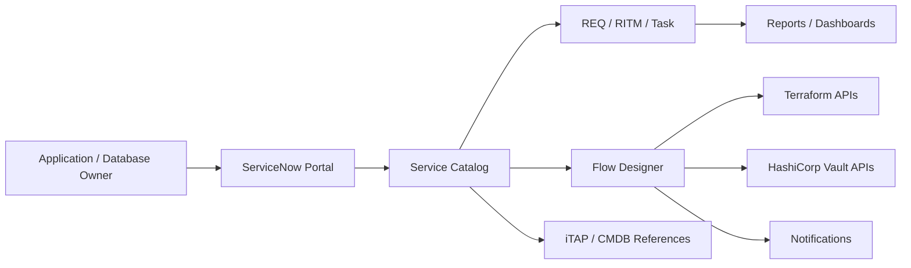

# AT&T CSO HashiCorp Vault ServiceNow Architecture And Design

## 1. Document Control

| Field | Value |
|---|---|
| Version | Extracted architecture/design draft from v5.1 source |
| Date | 06-Apr-2026 source date |
| Status | `Draft` |
| Owner | TBD |
| Contributors | Atul Puranik, Santhoshkumar Sivaji, Ishita Aggarwal |
| Reviewers | TBD |
| Source Inputs | `AT&T-CSO_HashiCorp_Vault_HLD_v5.1 (1).docx` |

## 2. Architecture Context

AT&T is introducing an enterprise-wide secrets management capability for application and database credentials. ServiceNow provides the intake, governance, workflow, approval, tracking, and operational visibility layer. Terraform and HashiCorp Vault perform the external execution and secrets management functions.

Architecture-relevant scale from the source document: more than 300 applications and more than 10,000 databases in the initial phase.

## 3. Architecture Scope And Non-Goals

| ID | Type | Item | Architecture Impact |
|---|---|---|---|
| SCOPE-001 | In Scope | ServiceNow self-service onboarding and lifecycle request capability | Requires Service Catalog, request lifecycle, Flow Designer, integrations, reporting, and RBAC. |
| SCOPE-002 | In Scope | Application onboarding to HashiCorp Vault | Requires catalog item, validation, approval, Terraform integration, Vault metadata tracking, and notifications. |
| SCOPE-003 | In Scope | Static secret create/update/delete request flows | Requires strict secret-handling controls so secret values are not stored in ServiceNow. |
| SCOPE-004 | In Scope | Dynamic database access request flow | Requires database selection, permission level, max TTL, approval, and external execution. |
| SCOPE-005 | In Scope | Dashboards and reporting for pending/onboarded applications | Requires metadata tables or reporting-friendly records. |
| OOS-001 | Out Of Scope | Storing or managing secret values in ServiceNow | ServiceNow must remain metadata-only for governance and tracking. |
| OOS-002 | Out Of Scope | Direct implementation of Terraform/Vault internals inside ServiceNow | ServiceNow triggers and tracks execution; Terraform/Vault own execution. |

## 4. Target ServiceNow Architecture

| Area | Design Decision | Rationale | Status |
|---|---|---|---|
| ServiceNow role | System of intake, workflow orchestration, governance, tracking, and operational visibility | Keeps request lifecycle and audit centralized. | Draft |
| External execution | Terraform and HashiCorp Vault execute secrets management operations | Sensitive execution happens outside ServiceNow. | Draft |
| Secret handling boundary | ServiceNow must not store or log secret values | Prevents secret exposure in variables, work notes, logs, tables, and reports. | Draft |
| Request lifecycle | Use native REQ/RITM/task lifecycle initially | Aligns with ServiceNow standard request management. | Draft |
| Integration model | Flow Designer/IntegrationHub REST calls to Terraform and Vault | Supports governed orchestration and status handling. | Draft |
| Data duplication | Prefer reference-based access to existing iTAP/CMDB data | Reduces duplicate ownership/application data in custom scope. | Draft |

## 5. ServiceNow Modules And Capabilities

| Module / Capability | Usage In Solution | Configuration / Design Notes | Owner |
|---|---|---|---|
| Service Catalog | Primary intake for onboarding and operational requests | New catalog items under CSO / Identity and Access Management. | ServiceNow team |
| Service Portal / Employee Center | Self-service request experience | Users submit and track requests. | ServiceNow team |
| Flow Designer | Orchestrates validation, approval, integration, and status updates | Integrates with Terraform/Vault through REST/IntegrationHub. | ServiceNow team |
| Request Management | Tracks REQ/RITM/task lifecycle | Request states include requested, processing, completed, failed. | ServiceNow team |
| Access Control / ACLs | Controls which users can request/view/manage applications and databases | Role and reference-qualifier driven. | ServiceNow team |
| Notifications | Sends non-sensitive success/failure notifications | Email notifications for onboarding result. | ServiceNow team |
| Reporting / Dashboards | Shows pending and onboarded applications | Dashboard for operational visibility. | ServiceNow team |
| CMDB / iTAP references | Validates application and owner metadata | Read-only reference to active production applications. | Data owners |

## 6. Custom Scoped Application Design

| Area | Design | Notes / Open Questions |
|---|---|---|
| Application name / scope | HashiCorp Vault Management Application | Scoped app for ServiceNow-Terraform-Vault integration. |
| Catalog items | Application Onboarding, Static Secret Create, Static Secret Update/Delete, Dynamic Database Access | Catalog names should be confirmed. |
| Record producers / order guides | Initially rely on catalog and REQ/RITM; record producers/order guide may be future scope | Confirm if any record producers are needed for v1. |
| Flows / subflows | Flow Designer workflows for validation, approvals, external execution, status update, notifications | Flow/subflow names TBD. |
| Script includes / actions | Integration helper logic likely needed for REST calls, validation, response parsing | Confirm platform standards. |
| Custom tables | App onboarding/tracking and possibly integration transaction logging | Exact table names and field model need confirmation. |
| Roles / groups / ACLs | Vault requester, application owner, DB owner, developer/admin style roles | Role names need final naming standard. |
| Integration configuration | Connection and Credential Alias for Terraform and Vault endpoints | Auth methods/endpoints TBD. |

## 7. System Context Diagram

## 8. Current-State Process Architecture

| Step | Current Process | Architectural Pain / Risk |
|---|---|---|
| 1 | Application/database teams manage credentials locally using property files or environment variables. | Fragmented secret handling and inconsistent control. |
| 2 | Requests are raised through different tools, tickets, email, or direct communication. | No standardized intake or traceability. |
| 3 | Ownership validation and approvals are manual or inconsistent. | Governance varies across teams. |
| 4 | DBAs/support teams manually update and share credentials. | High risk of insecure sharing and audit gaps. |
| 5 | Application teams update configuration and redeploy/restart. | Operational overhead and inconsistent rollout. |
| 6 | Limited centralized tracking and auditability. | Reduced visibility and increased security risk. |

## 9. Future-State Process Architecture

| Step | Future Process | ServiceNow Component | External System | Output / State |
|---|---|---|---|---|
| 1 | Request submission through standardized catalog items | Service Catalog / Portal |  | REQ/RITM created |
| 2 | Application/ownership validation | Flow Designer, CMDB/iTAP reference | CMDB / iTAP | Validated request metadata |
| 3 | Approval workflow | Flow Designer / Approvals |  | Approved or rejected request |
| 4 | Request lifecycle tracking | REQ/RITM/task |  | Requested, processing, completed, failed |
| 5 | External execution trigger | Flow Designer / IntegrationHub / REST | Terraform and/or Vault | Run/operation started |
| 6 | Secrets management execution |  | Terraform / Vault | Vault configuration or secret operation completed |
| 7 | Status update and notification | Flow Designer / Notifications | Terraform / Vault response or callback | User notified |
| 8 | Centralized tracking and governance | RITM/custom tables/reporting |  | Audit and dashboard evidence |

## 10. Catalog And Intake Design

| Catalog Item / Producer | Purpose | User Persona | Roles Allowed | Restrictions | External Execution |
|---|---|---|---|---|---|
| Application Onboarding | Onboard application to Vault management | Application owner / SPOC | `HashiCorp_vault_requestor`, `AG - VaultApplicationOwner`, platform admin | Only for applications where user is owner/support group | Terraform and Vault |
| Static Secret Create | Create static secret under onboarded application | Application owner | `HashiCorp_vault_requestor`, `AG - VaultApplicationOwner` | Only if application is already onboarded | Vault direct workflow |
| Static Secret Update/Delete | Manage existing static secrets | Application owner | `HashiCorp_vault_requestor`, `AG - VaultApplicationOwner` | Only for secrets under user's application | Vault direct workflow |
| Dynamic Database Access | Request dynamic database credential access | DB/application owner | `HashiCorp_vault_requestor`, `AG - VaultDBOwner` | Limited to approved DB types and environments | Terraform and Vault |

## 11. Catalog Field And Variable Design

| Catalog Item | Section | Field | Type | Mandatory | Visibility / Condition | Source / Reference | Storage Rule |
|---|---|---|---|---|---|---|---|
| Application Onboarding | Field Details | Business Application | Reference | Yes | Always | `cmdb_ci_business_app` / iTAP | Metadata only |
| Application Onboarding | Field Details | Correlation ID | Auto/read-only | Yes | Always | Generated / iTAP reference per source notes | Metadata only |
| Application Onboarding | Field Details | Environment | Choice | Yes | Always | Dev / QA / UAT / Prod | Metadata only |
| Application Onboarding | Access & Security | Requestor Role | Auto | Yes | Always | User/session | Metadata only |
| Application Onboarding | Access & Security | Access Group | Reference | Yes | Always | `sys_user_group` | Metadata only |
| Application Onboarding | Integration Details | API Endpoint | String / auto-configured | TBD | Hidden/managed | Connection and Credential Alias | Do not expose credential material |
| Application Onboarding | Integration Details | Workspace ID | String/read-only | No | Hidden | Terraform response | Metadata only |
| Application Onboarding | Integration Details | Vault Path | String/read-only | No | Hidden | Terraform/Vault response | Metadata only, no secret values |
| Static Secret Create | Field Details | Business Application | Reference | Yes | Always | CMDB/iTAP | Metadata only |
| Static Secret Create | Field Details | Environment | Choice | Yes | Always | Approved environment list | Metadata only |
| Static Secret Create | Field Details | Secret Name | String | Yes | Always | User input | Metadata only |
| Static Secret Create | Field Details | Secret Key | String | Yes | Always | User input | Metadata only |
| Static Secret Create | Field Details | Secret Value | Sensitive input | Yes | Always | User input | Must not be stored in ServiceNow |
| Static Secret Management | Field Details | Secret Type | Choice | Yes | Always | Static/Dynamic taxonomy | Metadata only |
| Static Secret Management | Field Details | Operation | Choice | Yes | Always | Update/Delete | Metadata only |
| Static Secret Management | Update Details | Database Name | Dropdown | Conditional | Visible when secret type is dynamic | Approved database source | Metadata only |
| Static Secret Management | Update Details | Permission Level | Choice | Conditional | Visible when needed | Approved permission list | Metadata only |
| Dynamic DB Access | Field Details | Database Name | Dropdown | Yes | Always | Approved database source | Metadata only |
| Dynamic DB Access | Field Details | Permission Level | Choice | Yes | Always | Approved permission list | Metadata only |
| Dynamic DB Access | Field Details | Max TTL | Choice | Yes | Always | Approved TTL list | Metadata only |
| Dynamic DB Access | Approval & Governance | Security Approval | Reference | TBD | Based on policy | User/group | Metadata only |
| Dynamic DB Access | Approval & Governance | Justification | Multi-line | Yes | Always | User input | Non-sensitive only |

## 12. Request Lifecycle And State Model

| State | Actor / System | Action | ServiceNow Record Update | Audit Evidence |
|---|---|---|---|---|
| Requested | User | Submit catalog request | REQ/RITM created | Request history |
| Validating | Flow Designer | Validate app, owner, DB, environment | RITM work state / validation result | Validation log without secrets |
| Awaiting Approval | Approver | Approve/reject request | Approval record | Approval audit |
| Processing | Flow Designer | Trigger Terraform/Vault operation | RITM processing state, correlation ID, external run/operation ID | Integration transaction metadata |
| Completed | Flow Designer | Process non-sensitive success response | RITM completed, governance records updated | Completion evidence |
| Failed | Flow Designer | Process non-sensitive error response | RITM failed, user notified | Failure evidence |

## 13. Data And Reference Architecture

| Dataset / Table | How It Is Used | Source Of Truth | ServiceNow Table | Access Rule | Notes |
|---|---|---|---|---|---|
| iTAP application data | Reference business applications | ServiceNow Attcomm instance / iTAP | `cmdb_ci_business_app_list` per source notes | Read-only reference | Active production applications. |
| CMDB business application | Reference owners and security analyst | ServiceNow Attcomm instance / CMDB | `cmdb_ci_business_app` | Reference qualifier / ACL controlled | Active production applications. |
| Groups | Access group selection and restrictions | ServiceNow | `sys_user_group` | Role/ownership constrained | Used for access control. |

## 14. Custom Table Design

| Table | Purpose | Key Fields | Source / Update Trigger | Reporting Need | Retention / Audit |
|---|---|---|---|---|---|
| `x_att2_Vault_AppOnboarding` | Track application onboarding to HashiCorp Vault | App, environment, status, workspace ID, Vault path metadata, correlation ID | Catalog/Flow Designer/Terraform response | Onboarded applications dashboard | Audit metadata only |
| Integration transaction table TBD | Track Terraform/Vault operation status | Correlation ID, RITM, external run ID, status, non-sensitive error | Flow Designer integration steps | Failed/pending integration dashboard | No secret values |

## 15. Integration Architecture

| Integration | Direction | Pattern | Auth / Credential Handling | Sync/Async | Correlation | Owner |
|---|---|---|---|---|---|---|
| ServiceNow to Terraform | Outbound | REST API via Flow Designer/IntegrationHub | Connection and Credential Alias | Source mentions sync response and async callback; final pattern needs confirmation | Correlation ID | ServiceNow/Terraform owners |
| ServiceNow to Vault | Outbound | REST API via Flow Designer/IntegrationHub | Connection and Credential Alias | Synchronous for real-time static secret operations where applicable | Correlation ID | ServiceNow/Vault owners |

## 16. API / Payload Contract Summary

| Operation | Target | Required Business Inputs | Prohibited Fields | Response Handling | Failure Handling |
|---|---|---|---|---|---|
| ONBOARD_APPLICATION | Terraform | Business app, environment, access group, correlation ID | Secret values, derived Vault internals unless approved | Store workspace ID/Vault path metadata if returned | Non-sensitive failure message; update RITM |
| STATIC_SECRET_CREATE | Vault | App, environment, secret metadata, approved transient secret input path | ServiceNow persistence of secret value | Completion/failure response only | Non-sensitive failure message; update RITM |
| STATIC_SECRET_UPDATE_DELETE | Vault | App, environment, operation, secret metadata | Secret value persistence in ServiceNow | Completion/failure response only | Non-sensitive failure message; update RITM |
| GRANT_DYNAMIC_DB_ACCESS | Terraform/Vault | App, environment, database, permission level, max TTL, justification | Derived policy/path names unless approved | Completion/failure response and governance record | Non-sensitive failure message; update RITM |

## 17. Security, Access, And Secret Handling

| Area | Design | Control / Rule |
|---|---|---|
| Roles | Requester, application owner, DB owner, developer/admin roles | Least privilege and approval-based access. |
| Groups | Access group and ownership restrictions | Reference qualifiers and ACLs. |
| ACLs | Users can view/manage authorized apps and databases only | Role and ownership driven. |
| Credential aliases | Integration credentials stored in ServiceNow Credential Store / Connection and Credential Alias | Platform-encrypted integration credentials, not app secrets. |
| Catalog variables | Secret values must not be persisted | Use secure transient handling or external Vault-native write path. |
| Flow logs / work notes | No secret payloads | Redaction and non-sensitive messages only. |
| Attachments / imports | No secret payloads | Block or reject secret-bearing files. |
| Audit | Metadata-only audit | Correlation ID, RITM, approval, external operation ID. |

## 18. Role And Persona Model

| Role / Persona | Purpose | Access Scope | Restrictions |
|---|---|---|---|
| `HashiCorp_VaultRequester` | Access application onboarding capability | Catalog request submission | Restricted by app ownership/support group where applicable. |
| `HashiCorp_VaultDBOwner` | Database onboarding/access capability | Dynamic DB access workflows | Limited to approved DB types/environments. |
| `HashiCorp_Developer` | ServiceNow developer activities in scoped app | Development/admin tasks | Non-production or governed admin access per platform standards. |
| Vault Application Owner group | Manage app-level Vault requests | App-specific records | Only apps they own/support. |

## 19. Notifications And User Communication

| Event | Recipient | Message Type | Sensitive Data Rule |
|---|---|---|---|
| Application onboarding success | Requester/application owner | Email | Non-sensitive metadata only. |
| Application onboarding failure | Requester/application owner/support | Email | Non-sensitive error only. |
| Static secret operation success/failure | Requester/application owner | Email/portal | Never include secret value. |
| Dynamic DB access success/failure | Requester/DB owner | Email/portal | Non-sensitive status only. |

## 20. Reporting And Dashboard Architecture

| Report / Dashboard | Audience | Data Source | Access Control | Purpose |
|---|---|---|---|---|
| Pending applications | ServiceNow/platform/security teams | RITM/custom onboarding table | Role/ownership based | Track pending onboarding. |
| Onboarded applications | Operations/security/application owners | Custom onboarding table | Role/ownership based | View onboarded app inventory. |
| Failed integrations | Support/platform teams | Integration transaction metadata | Support roles | Track failed Terraform/Vault calls. |

## 21. Error Handling And Resilience

| Failure Scenario | Detection | Retry / Recovery | User Message | Escalation |
|---|---|---|---|---|
| Terraform API failure | Integration response, timeout, or callback/polling result | Retry according to approved integration policy; update RITM | Non-sensitive failure message | Terraform/platform support |
| Vault API failure | Integration response | Retry only when safe/idempotent; otherwise manual support path | Non-sensitive failure message | Vault/platform support |
| Polling timeout / async callback missing | Scheduled polling or timeout threshold | Mark pending/failed based on policy; escalate | Non-sensitive delay/failure message | ServiceNow integration support |
| Validation failure | Flow Designer validation step | Return to requester or reject | Clear validation reason, no sensitive data | App owner/data owner |

## 22. Architecture Decisions

| ID | Decision | Alternatives | Rationale | Status |
|---|---|---|---|---|
| ADR-001 | Use ServiceNow catalog-driven intake for Vault onboarding and lifecycle requests | Ad hoc tickets/email, external portal | Standardizes request lifecycle and audit. | Proposed |
| ADR-002 | Use external Terraform/Vault platforms for execution | Implement execution in ServiceNow | Keeps secret and infrastructure execution outside ServiceNow. | Proposed |
| ADR-003 | Keep ServiceNow metadata-only for secret governance | Store encrypted secret values in ServiceNow | Reduces secret exposure risk. | Proposed |
| ADR-004 | Start with native REQ/RITM and catalog patterns | Build record-producer/order-guide model immediately | Lower platform complexity for initial version. | Proposed |

## 23. Assumptions, Constraints, Dependencies, And Risks

### Assumptions

| ID | Assumption | Validation Needed | Owner |
|---|---|---|---|
| ASM-001 | Terraform and Vault endpoints are reachable from ServiceNow MID or instance network path. | Confirm network path, allowlists, and MID requirement. | Platform/network |
| ASM-002 | iTAP and CMDB contain accurate application and owner metadata. | Validate data quality and active production scope. | Data owners |
| ASM-003 | Integration credentials are managed via Credential Store / Connection and Credential Alias. | Confirm auth method and credential ownership. | ServiceNow/platform |

### Constraints

| ID | Constraint | Architecture Impact | Owner |
|---|---|---|---|
| CON-001 | Network egress rules to Terraform/Vault endpoints | May require MID Server or network changes. | Network/platform |
| CON-002 | API rate limits and timeouts for long-running Terraform jobs | Requires async/polling/callback design and timeout policy. | Terraform/ServiceNow |
| CON-003 | Secret values must not be stored or logged in ServiceNow | Requires strict catalog variable and flow logging controls. | Security/ServiceNow |

### Dependencies

| ID | Dependency | Owner | Needed By | Impact If Missing |
|---|---|---|---|---|
| DEP-001 | Confirm Terraform API endpoints and auth method | Terraform/platform | Integration design | Blocks implementation. |
| DEP-002 | Confirm Vault API endpoints and auth method | Vault/platform | Static secret lifecycle flows | Blocks implementation. |
| DEP-003 | Confirm CMDB/iTAP source tables and data quality | Data owners | Catalog validation and reference qualifiers | Blocks reliable validation. |
| DEP-004 | Confirm custom table field model | ServiceNow architecture/dev | Reporting and audit design | Blocks build detail. |

### Risks

| ID | Risk | Impact | Mitigation | Owner | Blocks Approval |
|---|---|---|---|---|---|
| RISK-001 | Secret value accidentally persists in ServiceNow variable, log, note, attachment, or table | High security exposure | Use transient handling, masking, no-logging controls, and review flows. | Security/ServiceNow | Yes |
| RISK-002 | Async Terraform behavior is unclear between callback, polling, and sync response statements | Integration ambiguity | Confirm final execution/status model. | ServiceNow/Terraform | Yes |
| RISK-003 | CMDB/iTAP data quality is insufficient | Incorrect ownership/access decisions | Validate source data and fallback handling. | Data owners | Yes |
| RISK-004 | Custom tables duplicate authoritative data | Governance/data drift | Store only metadata and references; use source of truth references. | ServiceNow architecture | No |

## 24. Open Questions

| ID | Question | Why It Matters | Owner | Blocks Approval |
|---|---|---|---|---|
| Q-001 | Should Terraform status handling use polling, callback, synchronous response, or a hybrid pattern? | Source document mentions both sync response/callback and broader async execution. | ServiceNow/Terraform | Yes |
| Q-002 | What are the final Terraform and Vault endpoints and auth methods? | Required for IntegrationHub/REST and Credential Alias design. | Platform owners | Yes |
| Q-003 | How will static secret value input be handled transiently without ServiceNow persistence or logging? | Critical security boundary. | Security/ServiceNow/Vault | Yes |
| Q-004 | What are the final custom table names and field model? | Needed for reporting, audit, and development. | ServiceNow architecture | Yes |
| Q-005 | Which exact roles/groups and naming standards should be used? | Needed for ACLs and catalog restrictions. | ServiceNow/security | Yes |
| Q-006 | What source controls approved database list, permission levels, and max TTL values? | Needed for Dynamic DB Access design. | DB/Vault owners | Yes |

## 25. Architecture Review Checklist

| Review Question | Status | Notes |
|---|---|---|
| Is the architecture scope clear? | Pending |  |
| Are ServiceNow modules and custom app boundaries defined? | Pending |  |
| Are catalog items, variables, storage rules, and role restrictions clear? | Pending |  |
| Are data/reference sources and target tables clear? | Pending |  |
| Are integration patterns, auth, correlation, and failure handling clear? | Pending |  |
| Are secret handling boundaries explicit and safe? | Pending |  |
| Are reporting, notification, and audit needs defined? | Pending |  |
| Are assumptions, constraints, dependencies, risks, and open questions complete? | Pending |  |

## 26. Approval / Freeze Checklist

- [ ] Target architecture and system boundaries are clear.
- [ ] ServiceNow modules, scoped app, roles, ACLs, and catalog design are reviewed.
- [ ] Current and future process architecture are documented.
- [ ] Data/reference architecture is reviewed.
- [ ] API/integration design is reviewed.
- [ ] Secret handling avoids ServiceNow storage/logging of secret values.
- [ ] Operational, reporting, notification, and audit behavior are reviewed.
- [ ] Critical/high risks are resolved or accepted.
- [ ] Freeze-blocking open questions are answered.
