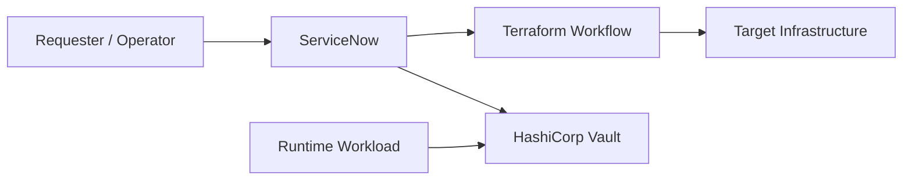

# <Solution Name> End-To-End Architecture

## Status

- Status: `Draft`
- Owner:
- Last Updated:
- Source:
- Architecture Freeze Target:

## Source Raw Input

```text
<Paste raw architecture input here exactly>
```

## Executive Summary

<One-page architecture summary.>

## Scope

| ID | In Scope | Rationale |
|---|---|---|
| SCOPE-001 |  |  |

## Out Of Scope

| ID | Out Of Scope | Rationale |
|---|---|---|
| OOS-001 |  |  |

## Architecture Principles

| ID | Principle | Reason |
|---|---|---|
| AP-001 | Static secret payloads must not be stored in Terraform state or plan files. | Prevent long-lived credential exposure. |

## Systems And Responsibilities

| System | Responsibility | Owner | Source Of Truth |
|---|---|---|---|
| ServiceNow |  |  |  |
| Terraform |  |  |  |
| HashiCorp Vault |  |  |  |

## Context Diagram



## Target State Architecture

| Component | Target State | Key Decisions |
|---|---|---|
| ServiceNow |  |  |
| Terraform |  |  |
| Vault |  |  |

## Trust Boundaries

| Boundary | Systems | Control |
|---|---|---|
| TB-001 | ServiceNow to Terraform |  |
| TB-002 | ServiceNow to Vault |  |
| TB-003 | Workload to Vault |  |

## Data And Secret Classification

| Data Type | Classification | Stored In | Must Not Be Stored In | Retention |
|---|---|---|---|---|
| Static secret payload | Highly Sensitive | Vault | Terraform state, Terraform plan, SNOW logs, SNOW variables |  |

## Integration Summary

| AID | Systems | Purpose | Status |
|---|---|---|---|
| AID-001 | ServiceNow and Terraform | Provisioning request and status contract | Draft |
| AID-002 | ServiceNow and Vault | Static secret request and fulfillment contract | Draft |

## Security Architecture

| Control | Design | Owner | Verification |
|---|---|---|---|
| Authentication |  |  |  |
| Authorization |  |  |  |
| Audit |  |  |  |
| Secret Handling |  |  |  |

## Operational Architecture

| Scenario | Owner | Workflow | Runbook |
|---|---|---|---|
| Provision request |  |  |  |
| Static secret onboarding |  |  |  |
| Secret rotation |  |  |  |
| Failure recovery |  |  |  |

## Observability

| Signal | Source | Consumer | Alert/Report |
|---|---|---|---|
|  |  |  |  |

## Architecture Decisions

| ID | Decision | Alternatives Considered | Rationale | Date |
|---|---|---|---|---|
| ADR-001 |  |  |  |  |

## Risks And Mitigations

| ID | Risk | Impact | Likelihood | Mitigation | Owner |
|---|---|---|---|---|---|
| RISK-001 |  |  |  |  |  |

## Open Questions

| ID | Category | Question | Why It Matters | Blocks Freeze |
|---|---|---|---|---|
| Q-001 | Decision Required |  |  | Yes |

## Freeze Checklist

- [ ] SNOW architecture is reviewed.
- [ ] SNOW-Terraform AID is reviewed.
- [ ] SNOW-Vault AID is reviewed.
- [ ] Terraform state and plan secret leakage risks are addressed.
- [ ] Static secret lifecycle is approved.
- [ ] Ownership and support model are clear.
- [ ] High-severity findings are resolved.
- [ ] Decision-required questions are answered.
