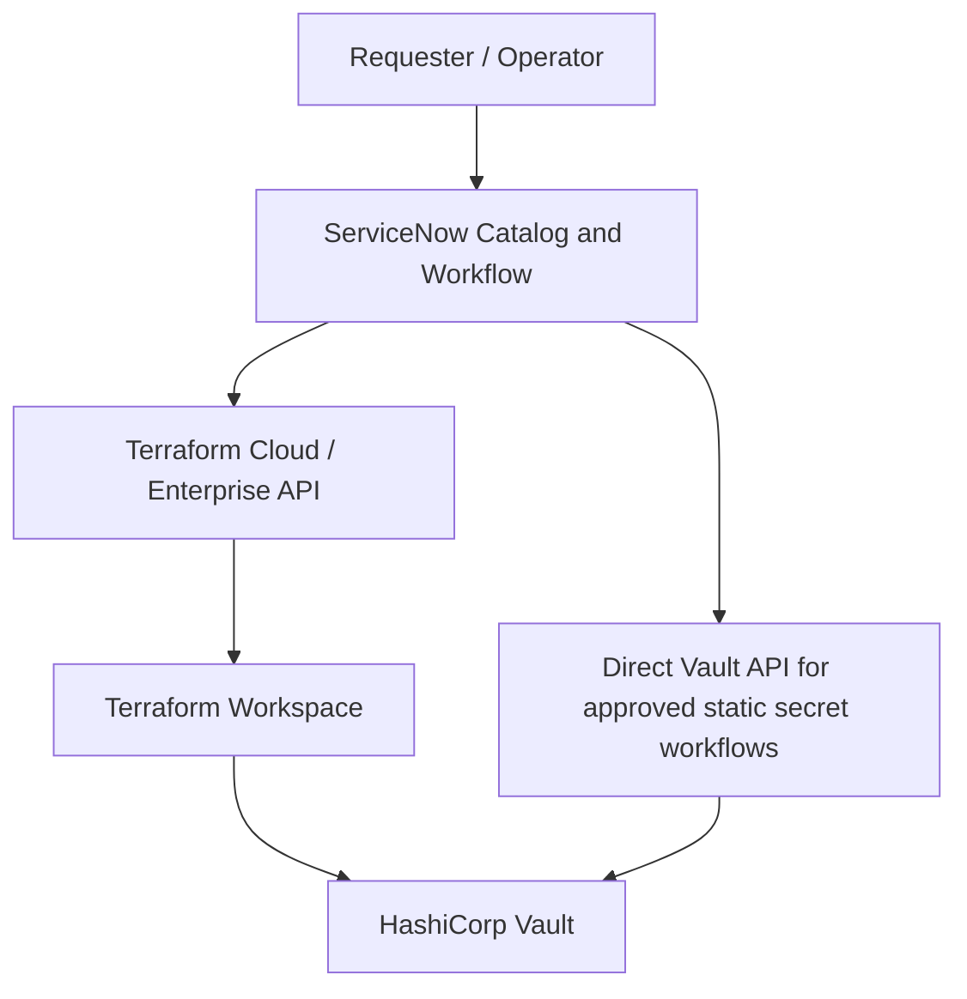
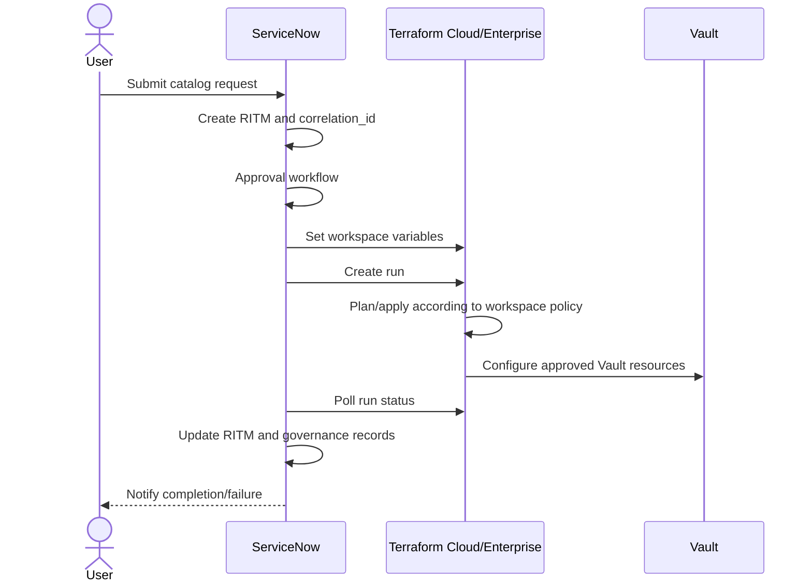

# Architecture And Integration Design: ServiceNow, Terraform, And HashiCorp Vault

## 1. Status And Ownership

- Status: `Draft | Needs Answers | Ready For Review | Ready To Freeze | Frozen`
- Version:
- Owner:
- Last Updated:
- Supersedes:

## 2. Introduction And Vision

<Describe the ServiceNow, Terraform, and Vault integration vision.>

## 3. Key Design Principles

| ID | Principle | Rationale | Status |
|---|---|---|---|
| AIDP-001 | ServiceNow is the system of engagement and governance. | User-facing intake, approvals, request lifecycle, and audit are governed in ServiceNow. | Open |
| AIDP-002 | Terraform owns provisioning and Vault configuration control. | IaC provides repeatability and traceable infrastructure changes. | Open |
| AIDP-003 | Vault is the system of truth for secrets. | Secret values and access controls belong in Vault. | Open |
| AIDP-004 | Static secret payloads must not enter Terraform state or plan files. | Prevent long-lived credential exposure. | Confirmed |
| AIDP-005 | ServiceNow must not store, process, or log secret values. | Preserve governance without secret exposure. | Confirmed |

## 4. System Responsibilities And Boundaries

| System | Role | Responsibilities | Explicit Non-Responsibilities |
|---|---|---|---|
| ServiceNow | System of engagement and governance | Service Catalog intake, validation, approval workflow, request lifecycle, orchestration trigger, status tracking, audit records | Must not store/process secret values. Must not own Vault internal naming or policy logic unless explicitly confirmed. |
| Terraform Cloud/Enterprise | Provisioning and configuration control | Vault policy, auth, role, namespace, mount, metadata, workspace/run lifecycle where approved | Must not manage long-lived static secret payloads. |
| HashiCorp Vault | System of truth for secrets and access enforcement | Secret storage, dynamic credentials, access policies, auth, audit logging | Must not depend on ServiceNow for enforcement of secret access. |

## 5. Integration Ground Rules

| ID | Rule | Required Design |
|---|---|---|
| GR-001 | Intent-based contracts | ServiceNow sends business intent and identifiers, not implementation details. |
| GR-002 | Minimal payload principle | Payloads contain only required business inputs, identifiers, and correlation metadata. |
| GR-003 | Terraform-owned configuration | Terraform derives policy names, roles, paths, and implementation constructs unless explicitly approved otherwise. |
| GR-004 | Loose coupling | ServiceNow should not hardcode Vault internal structures or Terraform implementation details. |
| GR-005 | Idempotent operations | Repeated requests with the same business identity must not create duplicates. |
| GR-006 | Correlation and traceability | Every request includes `correlation_id` linking ServiceNow, Terraform runs, Vault operations, and audit logs. |
| GR-007 | No secret exposure | ServiceNow, Terraform state/plans, CI logs, PRs, and documentation must not contain secret payloads. |
| GR-008 | Asynchronous execution | Terraform provisioning uses async run execution and status polling unless confirmed otherwise. |
| GR-009 | Structured non-sensitive errors | Errors are actionable and do not disclose secret values. |

## 6. Conceptual Diagram

## 7. Data Model And Interaction Flow

### 7.1 Internal Data Ownership

| System | Owns | Notes |
|---|---|---|
| ServiceNow | Request lifecycle, approval state, governance metadata, correlation IDs | Does not own secret values. |
| Terraform | IaC state and configuration metadata | Must not include static secret payloads. |
| Vault | Secret values, policies, auth, dynamic credentials, audit events | Source of truth for secret material. |

### 7.2 Asynchronous Terraform Provisioning Flow

## 8. Terraform Workspace Strategy

| Concern | Owner | Design / Decision | Status |
|---|---|---|---|
| Workspace granularity |  |  | Open |
| Workspace creation |  |  | Open |
| Auto-apply policy |  |  | Open |
| Workspace ID storage |  |  | Open |
| Environment strategy |  |  | Open |
| Retry/idempotency |  |  | Open |

## 9. Use Case Contracts

### UC-001 - Application Onboarding

**Goal:** Provision approved Vault configuration for an application scope.  
**Trigger:** Approved ServiceNow catalog request.  
**Operation:** `ONBOARD_APPLICATION`  
**Status:** Open

#### Request Variables

| Field | Type | Required | Owner | Classification | Notes |
|---|---|---|---|---|---|
| operation | String | Yes | ServiceNow | Internal | Business intent. |
| correlation_id | String | Yes | ServiceNow | Internal | End-to-end traceability. |
| application_id | String | Yes | ServiceNow | Internal | Confirm canonical source. |
| application_name | String | Yes | ServiceNow | Internal | Human-readable. |
| environment | String | Yes | ServiceNow | Internal | DEV/TEST/PROD or approved taxonomy. |

#### ServiceNow Must Not Send

- `vault_policy_name`
- `vault_approle_name`
- `secret_path`
- static secret payloads

#### Success Response / Poll Output

| Field | Type | Required | Classification | Notes |
|---|---|---|---|---|
| correlation_id | String | Yes | Internal | Matches request. |
| status | String | Yes | Internal | Terminal or processing status. |
| run_id | String | Yes | Internal | Terraform run identifier. |
| provisioned_artifacts | Object | No | Internal | Non-secret governance metadata only. |

#### Failure Response

| Field | Type | Required | Classification | Notes |
|---|---|---|---|---|
| error.code | String | Yes | Internal | Machine-readable. |
| error.message | String | Yes | Internal | Non-sensitive actionable message. |

#### Idempotency

Repeated onboarding for the same uniqueness key must reconcile safely and avoid duplicate Vault resources.

**Open Decision:** confirm uniqueness key, for example `application_id + sub_application + environment`.

### UC-002 - Dynamic Credential Access

**Goal:** Grant an approved application access to dynamic credentials.  
**Trigger:** Approved access request.  
**Operation:** `GRANT_DYNAMIC_ACCESS`  
**Status:** Open

#### Request Variables

| Field | Type | Required | Owner | Classification | Notes |
|---|---|---|---|---|---|
| operation | String | Yes | ServiceNow | Internal | Business intent. |
| correlation_id | String | Yes | ServiceNow | Internal | Traceability. |
| application_id | String | Yes | ServiceNow | Internal | App identity. |
| environment | String | Yes | ServiceNow | Internal | Target environment. |
| target_resource_id | String | Yes | ServiceNow | Internal | Database/resource identity from authoritative registry. |
| permission_level | String | Yes | ServiceNow | Internal | Confirm allowed values. |

### UC-003 - Disable / Deprovision Access

**Goal:** Remove or disable approved access without orphaning governance records.  
**Trigger:** Offboarding, expiry, access review, or request.  
**Operation:** `DISABLE_ACCESS`  
**Status:** Open

### UC-004 - Static Secret Lifecycle

**Goal:** Manage static secret metadata and approved direct Vault secret operations without Terraform managing payloads.  
**Trigger:** Approved onboarding, update, rotation, revocation, or break-glass workflow.  
**Operation:** `STATIC_SECRET_LIFECYCLE`  
**Status:** Open

**Non-Negotiable:** Static secret values must bypass Terraform and must not be stored in ServiceNow.

## 10. Authentication And Authorization

| Path | Auth Method | Credential Storage | Authorization | Status |
|---|---|---|---|---|
| ServiceNow to TFC/E |  |  |  | Open |
| Terraform to Vault |  |  |  | Open |
| ServiceNow to Vault direct API |  |  |  | Open |

## 11. Secret Handling And Logging Controls

| Boundary | Allowed | Prohibited | Evidence |
|---|---|---|---|
| ServiceNow | Metadata, request state, non-secret artifacts | Secret values |  |
| Terraform | Vault configuration metadata | Static secret payloads in state/plans/vars/outputs |  |
| Vault | Secret values, policies, auth, audit |  |  |
| CI/CD | Short-lived identity metadata | Secret payloads in logs |  |

## 12. Error Handling And Resilience

| Error Category | Owner | Detection | Response | Retry | User Message |
|---|---|---|---|---|---|
| Terraform run failure | Terraform / ServiceNow |  |  |  | Non-sensitive |
| Vault API failure | Terraform or ServiceNow direct workflow |  |  |  | Non-sensitive |
| Poll timeout | ServiceNow |  |  |  | Non-sensitive |
| Duplicate request | ServiceNow / Terraform |  |  |  | Non-sensitive |

## 13. Observability And Audit Traceability

| Signal | Source | Consumer | Correlation Field | Retention / Evidence |
|---|---|---|---|---|
| ServiceNow RITM event | ServiceNow |  | correlation_id |  |
| Terraform run | TFC/E |  | correlation_id |  |
| Vault audit event | Vault |  | correlation_id or request metadata |  |

## 14. Naming, Scoping, And Uniqueness

| Concern | Owner | Rule | Status |
|---|---|---|---|
| Uniqueness key |  |  | Open |
| Terraform workspace name |  |  | Open |
| Vault path convention | Terraform / Vault owner |  | Open |
| Policy/role naming | Terraform |  | Open |

## 15. Security And Governance

| Control | Design | Owner | Verification |
|---|---|---|---|
| Least privilege |  |  |  |
| Audit evidence |  |  |  |
| Break-glass |  |  |  |
| Approval workflow |  |  |  |
| Code review guardrails |  |  |  |

## 16. Open Items And Team Notes

| ID | Item | Owner | Needed By | Blocks Freeze |
|---|---|---|---|---|
| Q-001 | Confirm Terraform workspace strategy. |  |  | Yes |
| Q-002 | Confirm ServiceNow-to-Vault direct auth method for static secret lifecycle. |  |  | Yes |
| Q-003 | Confirm uniqueness key for app/sub-app/environment scope. |  |  | Yes |

## 17. Interface Principles Quick Reference

| Principle | Summary |
|---|---|
| ServiceNow sends intent | Business identifiers, not implementation constructs. |
| Terraform derives configuration | Names, paths, policies, roles are derived in IaC unless approved otherwise. |
| Vault stores secrets | Secret payloads live in Vault, not ServiceNow or Terraform. |
| Every request is traceable | `correlation_id` links request, run, and audit events. |
| Errors are non-sensitive | No secret values in messages, logs, or tickets. |

## 18. Freeze Checklist

- [ ] All system responsibilities and non-responsibilities are reviewed.
- [ ] Ground rules are accepted by architecture/security/platform owners.
- [ ] Use cases have request, success, and failure contracts.
- [ ] Static secret lifecycle avoids Terraform state and ServiceNow storage.
- [ ] Auth methods are confirmed.
- [ ] Polling, timeout, retry, and idempotency rules are confirmed.
- [ ] Workspace, naming, scoping, and uniqueness rules are confirmed.
- [ ] Audit and observability evidence is defined.
- [ ] Operational ownership and runbooks are defined.
- [ ] Freeze-blocking open items are answered.
