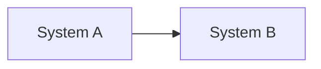
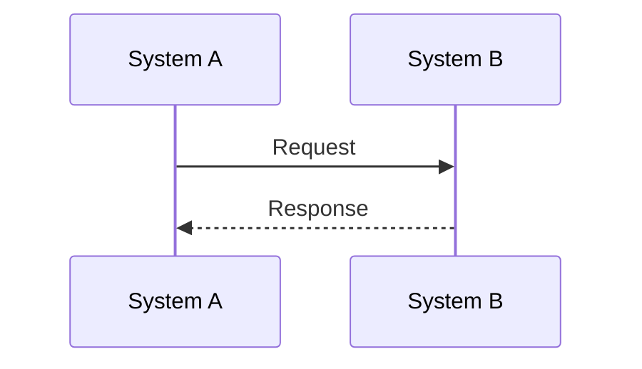
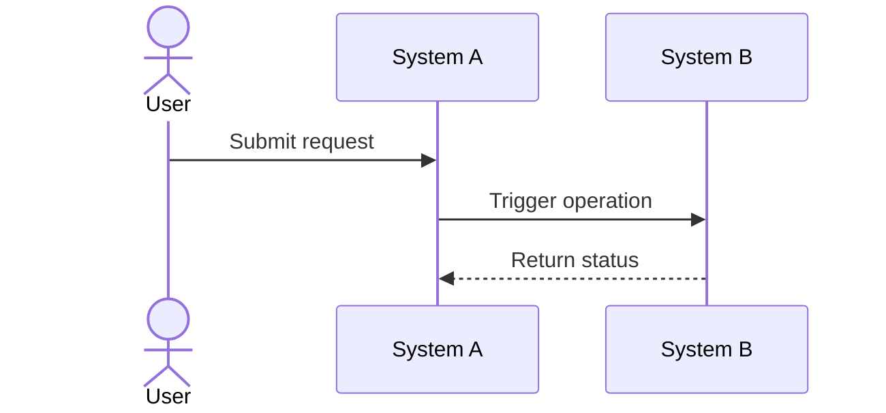

# Architecture Interface Document: <System A> - <System B>

## 1. Status And Ownership

- Status: `Draft | Needs Answers | Ready For Review | Ready To Freeze | Frozen`
- Version:
- Owner:
- Last Updated:
- Systems:
- Related Architecture:
- Related ADRs:

## 2. Introduction And Vision

<Why this interface exists and what business/technical outcome it enables.>

## 3. Key Design Principles

| ID | Principle | Rationale | Status |
|---|---|---|---|
| AIDP-001 |  |  | Open |

## 4. System Responsibilities And Boundaries

| System | Role | Responsibilities | Explicit Non-Responsibilities | Owner |
|---|---|---|---|---|
| System A |  |  |  |  |
| System B |  |  |  |  |

## 5. Integration Ground Rules

| ID | Rule | Design | Verification |
|---|---|---|---|
| AIDR-001 | Intent-based contract |  |  |
| AIDR-002 | Minimal payload |  |  |
| AIDR-003 | Loose coupling |  |  |
| AIDR-004 | Idempotency |  |  |
| AIDR-005 | Correlation and traceability |  |  |
| AIDR-006 | No secret exposure |  |  |
| AIDR-007 | Error handling responsibility split |  |  |

## 6. Solution Context Diagram

## 7. Interaction Model

| ID | Use Case | Trigger | Pattern | Sync/Async | Owner | Status |
|---|---|---|---|---|---|---|
| UC-001 |  |  | REST / Event / Batch / Workflow |  |  | Open |

## 8. End-To-End Flow

## 9. Payload Design Rules

| Rule | Applies To | Design |
|---|---|---|
| Intent fields only | Request |  |
| No derived implementation details | Request |  |
| Non-sensitive status only | Response |  |
| Correlation ID required | Request/Response |  |

## 10. Use Case Contracts

### UC-001 - <Use Case Name>

**Goal:**  
**Trigger:**  
**Operation:**  
**Source System:**  
**Target System:**  
**Owner:**  
**Status:** Open

#### Transaction Flow

#### Request Contract

| Field | Type | Required | Classification | Source | Validation | Notes |
|---|---|---|---|---|---|---|
| correlation_id | String | Yes | Internal | System A | Unique request ID |  |

#### Success Response Contract

| Field | Type | Required | Classification | Description |
|---|---|---|---|---|
| correlation_id | String | Yes | Internal | Original request ID |
| status | String | Yes | Internal | Terminal or processing status |

#### Failure Response Contract

| Field | Type | Required | Classification | Description |
|---|---|---|---|---|
| error.code | String | Yes | Internal | Machine-readable error |
| error.message | String | Yes | Internal | Non-sensitive user/action message |

#### Idempotency And Retry

| Concern | Design |
|---|---|
| Idempotency key |  |
| Duplicate handling |  |
| Retry behavior |  |
| Timeout behavior |  |

#### Audit And Observability

| Signal | Source | Consumer | Retention / Evidence |
|---|---|---|---|
|  |  |  |  |

#### Open Questions

| ID | Question | Why It Matters | Blocks Freeze |
|---|---|---|---|
| Q-001 |  |  | Yes |

## 11. Authentication And Authorization

| Control | Design | Owner | Status |
|---|---|---|---|
| Authentication |  |  | Open |
| Authorization |  |  | Open |
| Credential storage |  |  | Open |
| Network path |  |  | Open |

## 12. Data Classification And Secret Handling

| Data / Secret Type | Classification | Allowed Systems | Prohibited Systems / Logs | Handling Rule |
|---|---|---|---|---|
|  |  |  |  |  |

## 13. Error Handling And Responsibility Split

| Error Category | Owning System | Detection | Response | Escalation |
|---|---|---|---|---|
|  |  |  |  |  |

## 14. Operations, Support, And Runbooks

| Scenario | Owner | Runbook | SLA/SLO | Evidence |
|---|---|---|---|---|
|  |  |  |  |  |

## 15. Risks And Mitigations

| ID | Risk | Impact | Mitigation | Owner | Blocks Freeze |
|---|---|---|---|---|---|
| RISK-001 |  |  |  |  | Yes |

## 16. Decisions And ADR Links

| ADR ID | Decision | Status | Affects |
|---|---|---|---|
| ADR-001 |  | Proposed |  |

## 17. Open Items And Team Notes

| ID | Item | Owner | Needed By | Blocks Freeze |
|---|---|---|---|---|
| Q-001 |  |  |  | Yes |

## 18. Freeze Checklist

- [ ] Responsibilities and non-responsibilities are explicit.
- [ ] Ground rules are reviewed.
- [ ] Each use case has request, success, and failure contracts.
- [ ] Auth and authorization are reviewed.
- [ ] Secret handling and logging controls are reviewed.
- [ ] Idempotency, retry, timeout, and correlation are reviewed.
- [ ] Audit and observability evidence is defined.
- [ ] Operational ownership and runbooks are defined.
- [ ] Critical/high risks are resolved or accepted.
- [ ] Freeze-blocking questions are answered.
