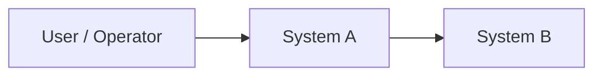

# <Solution Name> Enterprise Architecture Document

## 1. Executive Summary

- Status: `Draft | Needs Answers | Ready For Review | Ready To Freeze | Frozen`
- Version:
- Owner:
- Last Updated:
- Source Inputs:
- Architecture Freeze Target:

<Leadership-friendly summary of business purpose, target architecture, major decisions, risks, tradeoffs, and decisions needed.>

**Why?** Executives need a truthful decision and readiness view.

## 2. Background And Problem Statement

<Why this architecture is needed, what triggered it, and what problem it solves.>

## 3. Business And Architecture Goals

| ID | Goal | Success Measure | Owner | Source |
|---|---|---|---|---|
| GOAL-001 |  |  |  |  |

## 4. Current State

<Current systems, process, architecture, pain points, constraints, and known risks.>

## 5. Future State

<Target architecture outcome, operating model, and measurable improvements.>

## 6. Scope And Non-Goals

| ID | Type | Item | Rationale |
|---|---|---|---|
| SCOPE-001 | In Scope |  |  |
| OOS-001 | Out Of Scope |  |  |

## 7. Requirements And Constraints

| ID | Type | Statement | Source | Status |
|---|---|---|---|---|
| REQ-001 | Functional |  |  | Open |
| NFR-001 | Non-Functional |  |  | Open |
| CON-001 | Constraint |  |  | Open |

## 8. Architecture Principles

| ID | Principle | Rationale | Status |
|---|---|---|---|
| AP-001 | Static secret payloads must not be stored in Terraform state, plan files, variables, outputs, CI logs, or pull requests. | Prevent long-lived credential exposure. | Confirmed |

## 9. Stakeholders, Owners, And Decision Authorities

| ID | Stakeholder / Team | Role | Owns | Decision Authority |
|---|---|---|---|---|
| STK-001 |  |  |  |  |

## 10. Context Diagram

## 11. System Landscape

| ID | System | Responsibility | Owner | Source Of Truth | Criticality |
|---|---|---|---|---|---|
| SYS-001 |  |  |  |  |  |

## 12. Component Architecture

| ID | Component | Responsibility | Runs In | Owner | Dependencies | Status |
|---|---|---|---|---|---|---|
| COMP-001 |  |  |  |  |  | Open |

## 13. Integration Architecture

| ID | Source | Target | Direction | Protocol / Pattern | Contract | Auth | Failure Handling | Owner | Status |
|---|---|---|---|---|---|---|---|---|---|
| INT-001 |  |  |  |  |  |  |  |  | Open |

## 14. Data Architecture

| ID | Data Flow / Store | Source Of Truth | Classification | Owner | Retention | Lineage / Transformation | Status |
|---|---|---|---|---|---|---|---|
| DATA-001 |  |  |  |  |  |  | Open |

## 15. Security, Privacy, And Trust Boundaries

| ID | Boundary / Control | Systems / Assets | Control Design | Verification | Status |
|---|---|---|---|---|---|
| SEC-001 |  |  |  |  | Open |
| PRIV-001 |  |  |  |  | Open |

## 16. IAM, Secrets, And Credential Flow

| ID | Actor / Workload | Access Needed | Auth Method | Secret Handling | Audit | Status |
|---|---|---|---|---|---|
| IAM-001 |  |  |  |  |  | Open |

## 17. Platform, DevOps, And Deployment Architecture

| ID | Area | Design | Owner | Guardrail | Status |
|---|---|---|---|---|---|
| PLAT-001 | Environment strategy |  |  |  | Open |
| DEVOPS-001 | CI/CD |  |  |  | Open |

## 18. Resilience And Operational Architecture

| ID | Scenario / Need | Design | SLO/SLA | Owner | Runbook / Recovery | Status |
|---|---|---|---|---|---|---|
| OPS-001 |  |  |  |  |  | Open |
| RES-001 |  |  |  |  |  | Open |

## 19. Observability

| ID | Signal | Source | Consumer | Alert / Report | Owner |
|---|---|---|---|---|---|
| OBS-001 |  |  |  |  |  |

## 20. Cost And Governance

| ID | Area | Cost / Governance Concern | Control | Owner | Status |
|---|---|---|---|---|---|
| COST-001 |  |  |  |  | Open |
| GOV-001 |  |  |  |  | Open |

## 21. Architecture Decisions

| ID | Decision | Status | Alternatives Considered | Rationale | Consequences |
|---|---|---|---|---|---|
| ADR-001 |  | Proposed |  |  |  |

## 22. Risks And Mitigations

| ID | Risk | Impact | Likelihood | Mitigation | Owner | Status |
|---|---|---|---|---|---|---|
| RISK-001 |  |  |  |  |  | Open |

## 23. Assumptions

| ID | Assumption | Confidence | Affects | Validation Needed | Owner |
|---|---|---|---|---|---|
| ASM-001 |  | Medium | ARCH-001 |  |  |

## 24. Open Questions

| ID | Category | Question | Why It Matters | Affects | Blocks Freeze | Owner |
|---|---|---|---|---|---|---|
| Q-001 | Decision Required |  |  | ARCH-001 | Yes |  |

## 25. Architecture Traceability

| Goal / Requirement ID | Components | Integrations | Data / Security / Ops IDs | ADRs | Risks | Questions |
|---|---|---|---|---|---|---|
| GOAL-001 | COMP-001 | INT-001 | DATA-001, SEC-001, OPS-001 | ADR-001 | RISK-001 | Q-001 |

## 26. Architecture Freeze Checklist

- [ ] Scope and non-goals are explicit.
- [ ] Major components have responsibilities and owners.
- [ ] Integration contracts, auth, ownership, and failure modes are defined or questioned.
- [ ] Data source of truth, classification, retention, and access are defined or questioned.
- [ ] Security, privacy, trust boundaries, IAM, and secrets handling are reviewed.
- [ ] Platform, deployment, IaC, and rollback model are reviewed.
- [ ] Resilience, observability, support, and incident handling are reviewed.
- [ ] Cost, licensing, and governance assumptions are reviewed.
- [ ] ADRs exist for major decisions.
- [ ] Critical/high findings are resolved or explicitly accepted.
- [ ] Freeze-blocking questions are answered.
- [ ] Architecture traceability has no orphan critical components or integrations.
- [ ] Approval owners are recorded.
