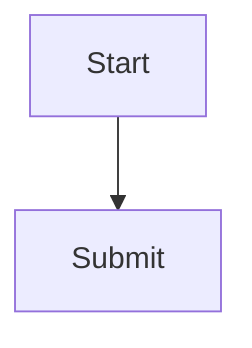

# HLD Review Response: <Solution Name>

## 1. Review Metadata

| Field | Value |
|---|---|
| Version |  |
| Date |  |
| Status | `Draft | Final | Approved` |
| Reference Documents |  |

## 2. Finalized Design And Architecture Decisions

| ID | Decision Area | Final Decision | Rationale | Source |
|---|---|---|---|---|
| D-001 |  |  |  |  |

## 3. Catalog / Portal Item Designs

### 3.1 <Catalog Or Portal Item Name>

#### Screen Layout

```text
<ASCII layout or description>
```

#### Field Specification

| Field | Variable Name | Type | Max Length | Mandatory | Source / Values | Conditions / Restrictions |
|---|---|---|---|---|---|---|
|  |  |  |  |  |  |  |

#### Flow Diagram



## 4. Custom Table Design - Full Detail

### 4.1 Data Types, Lengths, And Unique Keys

| Table | Column | Data Type | Max Length | Nullable | Default | Unique Key / Index |
|---|---|---|---|---|---|---|
|  |  |  |  |  |  |  |

## 5. ACLs And Groups

| Group / Role | Members | Purpose |
|---|---|---|
|  |  |  |

| Table | Operation | Who | Row-Level Condition |
|---|---|---|---|
|  |  |  |  |

## 6. Business Rules And Data Validation

| ID | Rule Name | Table | Event | Logic | Priority |
|---|---|---|---|---|---|
| BR-001 |  |  |  |  | High |

## 7. Response To Specific Review Questions

| Question | Answer | Decision / Correction | Status |
|---|---|---|---|
|  |  |  |  |

## 8. Appendices

### Appendix A - RBAC Matrix

| Role | Capability | Access | Notes |
|---|---|---|---|
|  |  |  |  |

### Appendix B - Event Types Reference

| Event Type | Resource Type | Trigger |
|---|---|---|
|  |  |  |
