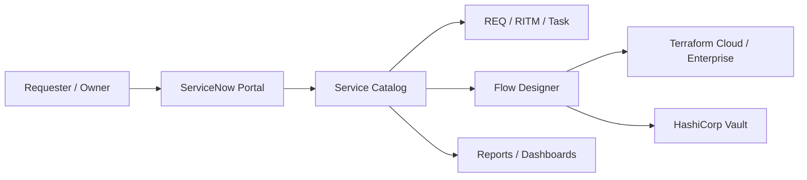

# <Solution Name> ServiceNow Architecture And Design

## 1. Document Control

| Field | Value |
|---|---|
| Version |  |
| Date |  |
| Status | `Draft | Needs Answers | Ready For Review | Approved | Frozen` |
| Owner |  |
| Contributors |  |
| Reviewers |  |
| Source Inputs |  |

## 2. Architecture Context

<Briefly summarize the business/technical context only where it affects architecture. Avoid long business justification.>

## 3. Architecture Scope And Non-Goals

| ID | Type | Item | Architecture Impact |
|---|---|---|---|
| SCOPE-001 | In Scope |  |  |
| OOS-001 | Out Of Scope |  |  |

## 4. Target ServiceNow Architecture

| Area | Design Decision | Rationale | Status |
|---|---|---|---|
| ServiceNow role | System of engagement / governance / orchestration |  | Open |
| External execution | Terraform / Vault / other systems |  | Open |
| Secret handling boundary | Metadata-only in ServiceNow | Prevent secret exposure | Confirmed |
| Request lifecycle | REQ / RITM / Task |  | Open |
| Integration model | Flow Designer / IntegrationHub / REST |  | Open |

## 5. ServiceNow Modules And Capabilities

| Module / Capability | Usage In Solution | Configuration / Design Notes | Owner |
|---|---|---|---|
| Service Catalog |  |  |  |
| Service Portal / Employee Center |  |  |  |
| Flow Designer |  |  |  |
| Request Management |  |  |  |
| Access Control / ACLs |  |  |  |
| Notifications |  |  |  |
| Reporting / Dashboards |  |  |  |
| CMDB / CSDM |  |  |  |

## 6. Custom Scoped Application Design

| Area | Design | Notes / Open Questions |
|---|---|---|
| Application name / scope |  |  |
| Catalog items |  |  |
| Record producers / order guides |  |  |
| Flows / subflows |  |  |
| Script includes / actions |  |  |
| Custom tables |  |  |
| Roles / groups / ACLs |  |  |
| Integration configuration |  |  |

## 7. System Context Diagram

## 8. Current-State Process Architecture

| Step | Current Process | Architectural Pain / Risk |
|---|---|---|
| 1 |  |  |

## 9. Future-State Process Architecture

| Step | Future Process | ServiceNow Component | External System | Output / State |
|---|---|---|---|---|
| 1 | Request submitted | Catalog / Portal |  | REQ/RITM |
| 2 | Validation | Flow Designer / CMDB / iTAP |  | Validated request |
| 3 | Approval | Flow Designer / Approvals |  | Approved / rejected |
| 4 | Execution trigger | IntegrationHub / REST | Terraform / Vault | Run / operation started |
| 5 | Status handling | Flow Designer / scheduled polling / callback | Terraform / Vault | Completed / failed |
| 6 | Audit and reporting | RITM / custom tables / dashboards |  | Evidence |

## 10. Catalog And Intake Design

| Catalog Item / Producer | Purpose | User Persona | Roles Allowed | Restrictions | External Execution |
|---|---|---|---|---|---|
| Application Onboarding |  |  |  |  | Terraform / Vault |
| Static Secret Create |  |  |  |  | Vault direct workflow |
| Static Secret Update/Delete |  |  |  |  | Vault direct workflow |
| Dynamic Database Access |  |  |  |  | Terraform / Vault |

## 11. Catalog Field And Variable Design

| Catalog Item | Section | Field | Type | Mandatory | Visibility / Condition | Source / Reference | Storage Rule |
|---|---|---|---|---|---|---|---|
|  | Field Details | Business Application | Reference | Yes |  | CMDB / iTAP | Metadata only |

## 12. Request Lifecycle And State Model

| State | Actor / System | Action | ServiceNow Record Update | Audit Evidence |
|---|---|---|---|---|
| Requested | User | Submit request | REQ/RITM created | Request history |
| Approved | Approver | Approve/reject | Approval record | Approval audit |
| Processing | Flow Designer | Trigger integration | RITM state update | Correlation ID / run ID |
| Completed | Flow Designer | Store non-sensitive outcome | RITM completed | Completion evidence |
| Failed | Flow Designer | Store non-sensitive error | RITM failed | Failure evidence |

## 13. Data And Reference Architecture

| Dataset / Table | How It Is Used | Source Of Truth | ServiceNow Table | Access Rule | Notes |
|---|---|---|---|---|---|
| iTAP application data |  |  |  | Read-only reference |  |
| CMDB business application |  |  |  | Reference qualifier |  |

## 14. Custom Table Design

| Table | Purpose | Key Fields | Source / Update Trigger | Reporting Need | Retention / Audit |
|---|---|---|---|---|---|
|  |  |  |  |  |  |

## 15. Integration Architecture

| Integration | Direction | Pattern | Auth / Credential Handling | Sync/Async | Correlation | Owner |
|---|---|---|---|---|---|---|
| ServiceNow to Terraform | Outbound | REST / IntegrationHub | Connection and Credential Alias | Async / polling | correlation_id |  |
| ServiceNow to Vault | Outbound | REST / IntegrationHub | Connection and Credential Alias | Sync or async by operation | correlation_id |  |

## 16. API / Payload Contract Summary

| Operation | Target | Required Business Inputs | Prohibited Fields | Response Handling | Failure Handling |
|---|---|---|---|---|---|
| ONBOARD_APPLICATION | Terraform |  | Secret values, derived Vault names unless confirmed |  |  |
| STATIC_SECRET_CREATE | Vault | Metadata and approved secret payload handling path | ServiceNow persistence of secret value |  |  |
| GRANT_DYNAMIC_ACCESS | Terraform / Vault |  | Derived implementation details unless confirmed |  |  |

## 17. Security, Access, And Secret Handling

| Area | Design | Control / Rule |
|---|---|---|
| Roles |  | Least privilege |
| Groups |  | Reference qualifiers / ACLs |
| ACLs |  | Restrict records by ownership |
| Credential aliases |  | Platform encrypted integration credentials |
| Catalog variables |  | Do not persist secret values |
| Flow logs / work notes |  | No secret payloads |
| Attachments / imports |  | No secret payloads |
| Audit |  | Metadata and correlation only |

## 18. Role And Persona Model

| Role / Persona | Purpose | Access Scope | Restrictions |
|---|---|---|---|
| Vault Requester |  |  |  |
| Vault Application Owner |  |  |  |
| Vault DB Owner |  |  |  |
| Platform Admin / Developer |  |  |  |

## 19. Notifications And User Communication

| Event | Recipient | Message Type | Sensitive Data Rule |
|---|---|---|---|
| Request submitted |  | Email / portal | Non-sensitive |
| Execution complete |  | Email / portal | Non-sensitive |
| Execution failed |  | Email / portal | Non-sensitive error only |

## 20. Reporting And Dashboard Architecture

| Report / Dashboard | Audience | Data Source | Access Control | Purpose |
|---|---|---|---|---|
| Onboarding status |  |  |  |  |
| Pending approvals |  |  |  |  |
| Failed integrations |  |  |  |  |

## 21. Error Handling And Resilience

| Failure Scenario | Detection | Retry / Recovery | User Message | Escalation |
|---|---|---|---|---|
| Terraform API failure |  |  | Non-sensitive |  |
| Vault API failure |  |  | Non-sensitive |  |
| Polling timeout |  |  | Non-sensitive |  |
| Validation failure |  |  | Non-sensitive |  |

## 22. Architecture Decisions

| ID | Decision | Alternatives | Rationale | Status |
|---|---|---|---|---|
| ADR-001 |  |  |  | Proposed |

## 23. Assumptions, Constraints, Dependencies, And Risks

### Assumptions

| ID | Assumption | Validation Needed | Owner |
|---|---|---|---|
| ASM-001 |  |  |  |

### Constraints

| ID | Constraint | Architecture Impact | Owner |
|---|---|---|---|
| CON-001 |  |  |  |

### Dependencies

| ID | Dependency | Owner | Needed By | Impact If Missing |
|---|---|---|---|---|
| DEP-001 |  |  |  |  |

### Risks

| ID | Risk | Impact | Mitigation | Owner | Blocks Approval |
|---|---|---|---|---|---|
| RISK-001 |  |  |  |  | Yes |

## 24. Open Questions

| ID | Question | Why It Matters | Owner | Blocks Approval |
|---|---|---|---|---|
| Q-001 |  |  |  | Yes |

## 25. Architecture Review Checklist

| Review Question | Status | Notes |
|---|---|---|
| Is the architecture scope clear? | Pending |  |
| Are ServiceNow modules and custom app boundaries defined? | Pending |  |
| Are catalog items, variables, storage rules, and role restrictions clear? | Pending |  |
| Are data/reference sources and target tables clear? | Pending |  |
| Are integration patterns, auth, correlation, and failure handling clear? | Pending |  |
| Are secret handling boundaries explicit and safe? | Pending |  |
| Are reporting, notification, and audit needs defined? | Pending |  |
| Are assumptions, constraints, dependencies, risks, and open questions complete? | Pending |  |

## 26. Approval / Freeze Checklist

- [ ] Target architecture and system boundaries are clear.
- [ ] ServiceNow modules, scoped app, roles, ACLs, and catalog design are reviewed.
- [ ] Current and future process architecture are documented.
- [ ] Data/reference architecture is reviewed.
- [ ] API/integration design is reviewed.
- [ ] Secret handling avoids ServiceNow storage/logging of secret values.
- [ ] Operational, reporting, notification, and audit behavior are reviewed.
- [ ] Critical/high risks are resolved or accepted.
- [ ] Freeze-blocking open questions are answered.
