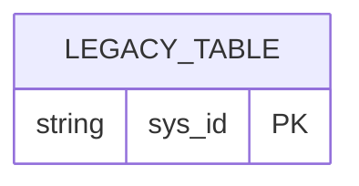
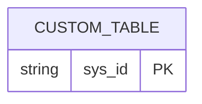
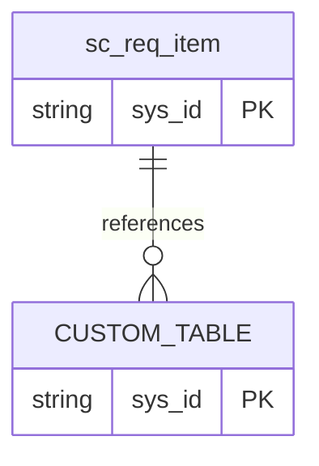
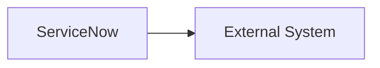

# <Solution Name> ServiceNow ERD Pack

## 1. Document Control

| Field | Value |
|---|---|
| Version |  |
| Date |  |
| Status | `Draft | Ready For Review | Approved` |
| Related Data Model |  |

## 2. Diagram Index

| Diagram | Purpose | Status |
|---|---|---|
| ERD 1 - Legacy / Previous Model | Optional evolution comparison |  |
| ERD 2 - Final Custom Model | Custom table relationships |  |
| ERD 3 - Comprehensive Model | Custom + native table interaction |  |
| ERD 4 - Integration Flow | ServiceNow / external system data movement |  |

## 3. ERD 1 - Legacy / Previous Model

## 4. ERD 2 - Final Custom Model

## 5. ERD 3 - Comprehensive Model

## 6. ERD 4 - Integration Flow Diagram

## 7. Model Evolution Summary

| Change | Previous | Final | Rationale |
|---|---|---|---|
|  |  |  |  |

## 8. Consistency Notes

| Check | Data Model | ERD | Status |
|---|---|---|---|
| Table count |  |  |  |

## 9. Open Questions

| ID | Question | Why It Matters | Blocks Approval |
|---|---|---|---|
| Q-001 |  |  | Yes |
