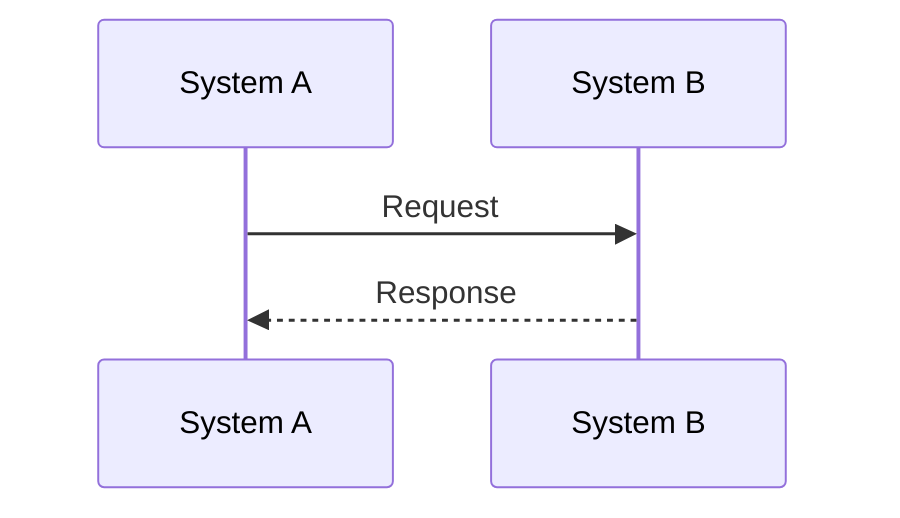

# <Solution Name> Architecture Interface Document

## 1. Status And Ownership

- Status: `Draft | Needs Answers | Ready For Review | Ready To Freeze | Frozen`
- Version:
- Systems:
- Owner:

## 2. Introduction And Vision

<Why this interface exists.>

## 3. System Responsibilities And Boundaries

| System | Role | Responsibilities | Explicit Non-Responsibilities |
|---|---|---|---|
| ServiceNow |  |  |  |
| Terraform |  |  |  |
| HashiCorp Vault |  |  |  |

## 4. Integration Ground Rules

| ID | Rule | Required Design |
|---|---|---|
| GR-001 | Intent-based contracts |  |
| GR-002 | Minimal payload |  |
| GR-003 | Idempotency |  |
| GR-004 | Correlation and traceability |  |
| GR-005 | No secret exposure |  |

## 5. Use Case Contracts

### UC-001 - <Use Case Name>

**Goal:**  
**Trigger:**  
**Operation:**  
**Status:** Open

#### Flow

#### Request Contract

| Field | Type | Required | Classification | Notes |
|---|---|---|---|---|
| correlation_id | String | Yes | Internal |  |

#### Response Contract

| Field | Type | Required | Classification | Notes |
|---|---|---|---|---|
| status | String | Yes | Internal |  |

## 6. Auth, Secret Handling, Errors, And Observability

| Area | Design | Owner | Status |
|---|---|---|---|
| Authentication |  |  | Open |
| Authorization |  |  | Open |
| Secret handling |  |  | Open |
| Error handling |  |  | Open |
| Observability |  |  | Open |

## 7. Open Questions

| ID | Question | Why It Matters | Blocks Freeze |
|---|---|---|---|
| Q-001 |  |  | Yes |
