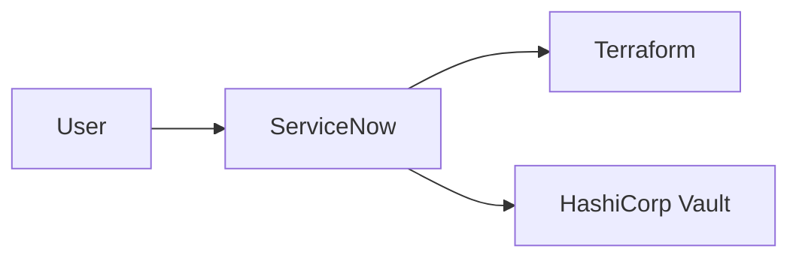

# <Solution Name> Enterprise Architecture

## 1. Executive Summary

- Status: `Draft | Needs Answers | Ready For Review | Ready To Freeze | Frozen`
- Version:
- Requirement Baseline:
- Owner:

## 2. Architecture Context

<Summarize the target architecture context.>

## 3. Goals, Scope, And Constraints

| ID | Type | Statement | Source |
|---|---|---|---|
| GOAL-001 | Goal |  |  |
| CON-001 | Constraint |  |  |

## 4. Architecture Principles

| ID | Principle | Rationale | Status |
|---|---|---|---|
| AP-001 |  |  | Open |

## 5. System Context

## 6. Component Architecture

| ID | Component | Responsibility | Owner | Dependencies |
|---|---|---|---|---|
| COMP-001 |  |  |  |  |

## 7. Integration, Data, Security, And Operations

| ID | Category | Design | Owner | Status |
|---|---|---|---|---|
| INT-001 | Integration |  |  | Open |
| DATA-001 | Data |  |  | Open |
| SEC-001 | Security |  |  | Open |
| OPS-001 | Operations |  |  | Open |

## 8. Architecture Decisions

| ID | Decision | Alternatives | Rationale | Status |
|---|---|---|---|---|
| ADR-001 |  |  |  | Proposed |

## 9. Risks And Open Questions

| ID | Type | Item | Impact | Blocks Freeze |
|---|---|---|---|---|
| RISK-001 | Risk |  |  | Yes |
| Q-001 | Question |  |  | Yes |

## 10. Architecture Freeze Checklist

- [ ] Requirement baseline is referenced.
- [ ] Components and integrations have owners.
- [ ] Security and operations are reviewed.
- [ ] ADRs exist for major decisions.
- [ ] Blocker questions are answered.
