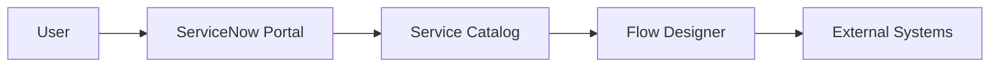

# <Solution Name> ServiceNow Architecture And Design

## 1. Status

- Status: `Draft | Needs Answers | Ready For Review | Approved | Frozen`
- Version:
- Requirement Baseline:
- Architecture Baseline:

## 2. Architecture Context

<Brief architecture context only.>

## 3. Target ServiceNow Architecture

| Area | Design Decision | Rationale | Status |
|---|---|---|---|
| ServiceNow role |  |  | Open |
| Request lifecycle | REQ / RITM / Task |  | Open |
| Integration model | Flow Designer / IntegrationHub / REST |  | Open |
| Secret handling boundary | Metadata only | Prevent secret exposure | Confirmed |

## 4. Modules, Scoped App, And Capabilities

| Module / Capability | Usage | Design Notes |
|---|---|---|
| Service Catalog |  |  |
| Flow Designer |  |  |
| Request Management |  |  |
| Access Control / ACLs |  |  |
| Reporting / Dashboards |  |  |
| CMDB / iTAP references |  |  |

## 5. System Context Diagram

## 6. Process Architecture

| Step | Future Process | ServiceNow Component | External System | Output |
|---|---|---|---|---|
| 1 | Request submission | Catalog / Portal |  | RITM |

## 7. Catalog And Field Design

| Catalog Item | Purpose | Roles Allowed | Restrictions | External Execution |
|---|---|---|---|---|
|  |  |  |  |  |

| Catalog Item | Field | Type | Mandatory | Source / Reference | Storage Rule |
|---|---|---|---|---|---|
|  |  |  |  |  | Metadata only |

## 8. Data, Tables, Integrations, Security, And Operations

| Category | Design | Status |
|---|---|---|
| Data/reference architecture |  | Open |
| Custom tables |  | Open |
| API/integration model |  | Open |
| Roles/ACLs |  | Open |
| Secret handling |  | Open |
| Notifications/reporting |  | Open |
| Error handling |  | Open |

## 9. Decisions, Risks, And Open Questions

| ID | Type | Item | Blocks Approval |
|---|---|---|---|
| ADR-001 | Decision |  |  |
| RISK-001 | Risk |  | Yes |
| Q-001 | Question |  | Yes |
