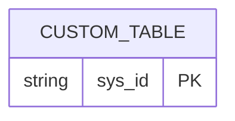
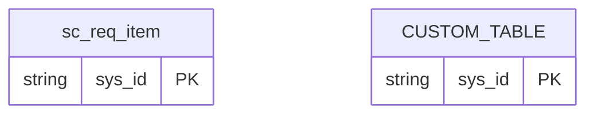
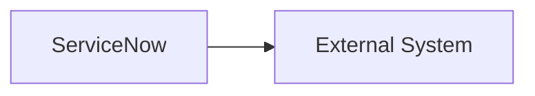

# <Solution Name> ServiceNow ERD Pack

## 1. Status

- Status: `Draft | Ready For Review | Approved`
- Related Data Model:

## 2. Final Custom Model

## 3. Comprehensive Native And Custom Model

## 4. Integration Flow Diagram

## 5. Model Evolution And Consistency

| Check | Status | Notes |
|---|---|---|
| Table count matches data model |  |  |

## 6. Open Questions

| ID | Question | Why It Matters | Blocks Approval |
|---|---|---|---|
| Q-001 |  |  | Yes |
