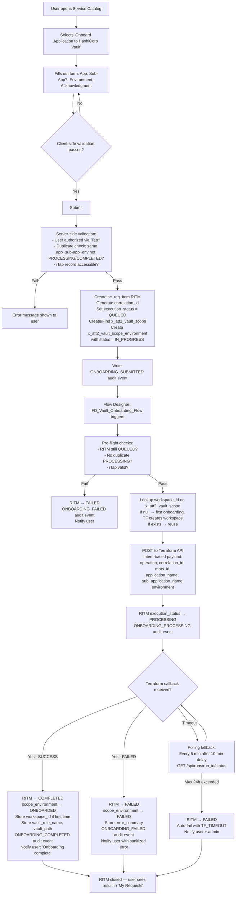
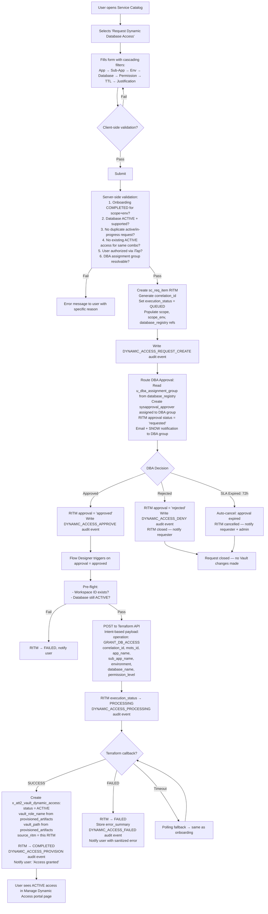

# HLD Review — Detailed Response to All Architecture Questions

**Version:** 1.0  
**Date:** 7 April 2026  
**Status:** FINAL  
**Reference Documents:**  
- AID v1.2 (Architecture & Integration Design)  
- ServiceNow Data Model v5.1  
- User Stories US 1.1–1.5, US 2.1–2.5, US 3.1–3.8  

---

## Table of Contents

1. [Finalized Design & Architecture Decisions](#1-finalized-design--architecture-decisions)
2. [4 Catalog Items — Screen Layouts, Field Tables, & Flow Diagrams](#2-four-catalog-items--screen-layouts-field-tables--flow-diagrams)
   - 2.1 Catalog Item 1: Onboard Application to HashiCorp Vault
   - 2.2 Catalog Item 2: Manage Static Secrets (Portal Page)
   - 2.3 Catalog Item 3: Request Dynamic Database Access
   - 2.4 Catalog Item 4: Manage Dynamic Database Access (Portal Page)
3. [Custom Table Design — Full Detail](#3-custom-table-design--full-detail)
   - 3.1 Data Types, Lengths & Unique Keys
   - 3.2 Resolution: Vault Application Owner Column
   - 3.3 Resolution: Correlation ID
   - 3.4 ACLs & Groups
   - 3.5 Business Rules & Data Validation

---

## 1. Finalized Design & Architecture Decisions

Every design and architecture decision below is **FINALIZED**. No item is "still being evaluated."

| # | Decision Area | Final Decision | Rationale |
|---|---|---|---|
| **D-1** | Data Model Approach | **Native-First ServiceNow:** 6 custom tables + 7 custom fields on native `sc_req_item`. No custom request tables. | Eliminates table bloat (v3.2 had 10 tables). Preserves native approvals, SLAs, portal widgets, activity streams. Approved by Executive Architect. |
| **D-2** | Scope Model | **Single `x_att2_vault_scope` table** replaces the separate `vault_application` + `vault_sub_application` tables. Sub-applications are indicated by a boolean `u_is_sub_application` flag and a `u_normalized_name`. | Eliminates redundant hierarchy, dual workspace tracking, and parent/sub-app state drift. |
| **D-3** | Request Handling | **Native `sc_req_item`** for both Onboarding and Dynamic Access. User input captured via Catalog Variables. Key integration fields stored as 7 custom fields prefixed `u_x_att2_`. | Using the native request model gives us REQ/RITM hierarchy, approval engine, portal widgets, SLA tracking, and full activity history for free. |
| **D-4** | Audit Strategy | **Retain custom `x_att2_vault_audit_event`** + native `sys_audit` for field-level changes. Eliminated `x_att2_vault_transaction_log` (redundant with IntegrationHub execution logs). | Native `sys_audit` cannot store structured business events (e.g., Correlation IDs, KV versions, event types) in a queryable format. The custom audit table is required for InfoSec reporting. |
| **D-5** | Terraform Workspace Model | **One workspace per scope** (app or sub-app). Same workspace across all environments (DEV, TEST, PROD). `workspace_id` is stored on `x_att2_vault_scope`. | Prevents workspace sprawl. First onboarding creates the workspace; subsequent environments reuse it. |
| **D-6** | ServiceNow ↔ Terraform Contract | **Intent-Based Contracts** (AID Ground Rules 2.1–2.9). ServiceNow sends WHAT (identifiers + business inputs), never HOW (no policy names, no paths, no role names). | Loose coupling. Terraform changes never require ServiceNow changes. |
| **D-7** | Static Secrets Integration | **Direct Vault API** from ServiceNow (not Terraform). Secret values must NEVER pass through Terraform state. | Prevents secret exposure in `tfstate` files or Terraform logs. |
| **D-8** | Dynamic Access Integration | **Terraform Async** (same pattern as onboarding). ServiceNow → Terraform → Vault. DBA approval required for all requests. | Ensures IaC consistency for all Vault policy/role changes. |
| **D-9** | DBA Approval | **Mandatory for ALL dynamic database access requests** — no exceptions regardless of database ownership. Uses native `sysapproval_approver`. | Enterprise governance requirement. DBA assignment group resolved from `x_att2_vault_database_registry`. |
| **D-10** | Secret Value Visibility | **ServiceNow NEVER stores, fetches, displays, or caches secret values.** Metadata only (name, path, version, timestamps). | Core security principle. Applications retrieve secrets from Vault at runtime using AppRole credentials. |
| **D-11** | Vault Application Owner Column | **REMOVED.** The database registry (`x_att2_vault_database_registry`) is intentionally **owner-agnostic**. Ownership context comes from the requesting scope at request time, not from the DB registry. | See Section 3.2 for full resolution. |
| **D-12** | Correlation ID | **RETAINED** on `sc_req_item` as `u_x_att2_correlation_id` and on `x_att2_vault_audit_event` as `u_correlation_id`. Format: `req-uid-{uuid_short}`. | See Section 3.3 for full resolution. |

---

## 2. Four Catalog Items — Screen Layouts, Field Tables, & Flow Diagrams

The CSO portal category **"HashiCorp Vault & Secrets Management"** exposes **4 items** to end users:

| # | Item Name | Type | Entry Point | Primary User Stories |
|---|---|---|---|---|
| 1 | Onboard Application to HashiCorp Vault | Catalog Item (`sc_cat_item`) | Service Catalog Form → RITM | US 1.1, 1.2, 1.3 |
| 2 | Manage Static Secrets | Portal Page (Custom Widget) | `/sp?id=vault_manage_secrets` | US 2.1, 2.3, 2.4, 2.5 |
| 3 | Request Dynamic Database Access | Catalog Item (`sc_cat_item`) | Service Catalog Form → RITM | US 3.1, 3.2, 3.3 |
| 4 | Manage Dynamic Database Access | Portal Page (Custom Widget) | `/sp?id=vault_dynamic_access` | US 3.5, 3.6 |

---

### 2.1. Catalog Item 1: Onboard Application to HashiCorp Vault

#### Screen Layout

```
┌──────────────────────────────────────────────────────────────────┐
│  SERVICE CATALOG: Onboard Application to HashiCorp Vault         │
├──────────────────────────────────────────────────────────────────┤
│                                                                  │
│  ┌─ SECTION 1: Application Selection ────────────────────────┐   │
│  │                                                           │   │
│  │  Application *          [ ▼ Search iTap applications... ] │   │
│  │                         (filtered by user ownership)      │   │
│  │                                                           │   │
│  │  ── Auto-populated (read-only) ──                         │   │
│  │  MOTS ID:               MOTS-101                          │   │
│  │  App Owner:             John Smith                        │   │
│  │  Organization:          finance                           │   │
│  │                                                           │   │
│  └───────────────────────────────────────────────────────────┘   │
│                                                                  │
│  ┌─ SECTION 2: Sub-Application (Optional) ───────────────────┐   │
│  │                                                           │   │
│  │  ☐ Onboarding for Sub-Application?                        │   │
│  │                                                           │   │
│  │  Sub-Application Name   [ __________________ ]            │   │
│  │  (visible only when checkbox is checked)                  │   │
│  │  (type-ahead from existing sub-apps + free text)          │   │
│  │                                                           │   │
│  └───────────────────────────────────────────────────────────┘   │
│                                                                  │
│  ┌─ SECTION 3: Environment ──────────────────────────────────┐   │
│  │                                                           │   │
│  │  Environment *          [ ▼ DEV / TEST / PROD ]           │   │
│  │                                                           │   │
│  └───────────────────────────────────────────────────────────┘   │
│                                                                  │
│  ┌─ SECTION 4: Acknowledgment ───────────────────────────────┐   │
│  │                                                           │   │
│  │  ☑ I accept responsibility for managing secrets for       │   │
│  │    this application. *                                    │   │
│  │                                                           │   │
│  └───────────────────────────────────────────────────────────┘   │
│                                                                  │
│                                   [ Cancel ]   [ Submit ▶ ]      │
│                                                                  │
└──────────────────────────────────────────────────────────────────┘
```

#### Field Specification Table

| # | Field | Variable Name | Type | Max Length | Mandatory | Source / Values | Conditions / Restrictions |
|---|---|---|---|---|---|---|---|
| 1 | Application | `application` | Reference | — | Yes | iTap application table | **Server-side filter:** `u_app_owner = current_user OR u_security_analyst = current_user OR u_alternate_owner = current_user`. Only active iTap records. Type-ahead search on name + MOTS ID. |
| 2 | MOTS ID | `mots_id` (display) | String | 40 | Read-only | Dot-walk: `application.u_mots_id` | Auto-populated on application selection. Not stored on RITM. |
| 3 | App Owner | `app_owner` (display) | String | 100 | Read-only | Dot-walk: `application.u_app_owner.name` | Auto-populated. Not stored on RITM. |
| 4 | Organization | `org` (display) | String | 100 | Read-only | Dot-walk: `application.u_organization` | Auto-populated. Not stored on RITM. |
| 5 | Sub-Application Checkbox | `is_sub_app` | Boolean | — | No | Default: unchecked | When checked → Sub-Application Name becomes visible + mandatory. |
| 6 | Sub-Application Name | `sub_app_name` | String | 255 | Conditional | Free-text + type-ahead from existing sub-apps for this parent | **Visible only if** `is_sub_app = true`. **Validation:** alphanumeric, spaces, hyphens, dots only. No special chars. Trimmed + normalized on submit. |
| 7 | Environment | `environment` | Choice | 20 | Yes | `DEV`, `TEST`, `PROD` | SIT and UAT are NOT options. |
| 8 | Acknowledgment | `acknowledgment` | Boolean | — | Yes | Must be checked | **Cannot submit unless checked.** |

#### End-to-End Flow Diagram (Submission to Closure)



---

### 2.2. Catalog Item 2: Manage Static Secrets (Portal Page)

#### Screen Layout

```
┌──────────────────────────────────────────────────────────────────────────┐
│  PORTAL PAGE: Manage Static Secrets                                      │
│  URL: /sp?id=vault_manage_secrets                                        │
├──────────────────────────────────────────────────────────────────────────┤
│                                                                          │
│  ┌─ FILTER CONTROLS ─────────────────────────────────────────────────┐   │
│  │                                                                   │   │
│  │  Application *    [ ▼ Select... ]   Sub-Application  [ ▼ or N/A ] │   │
│  │  Environment *    [ ▼ DEV/TEST/PROD (onboarded only) ]            │   │
│  │                                                                   │   │
│  └───────────────────────────────────────────────────────────────────┘   │
│                                                                          │
│  ┌─ SECRETS TABLE (metadata only — values NEVER shown) ──────────────┐   │
│  │                                                        [ + Add ]  │   │
│  │  ┌──────────────┬───────────┬─────┬────────────┬──────┬────────┐  │   │
│  │  │ Secret Name  │ Vault Path│ Ver │ Updated By │ Date │Actions │  │   │
│  │  ├──────────────┼───────────┼─────┼────────────┼──────┼────────┤  │   │
│  │  │ api-key      │ secret/.. │  3  │ John Smith │ 4/1  │✏️🗑️📜 │  │   │
│  │  │ db-password  │ secret/.. │  1  │ Jane Doe   │ 3/28 │✏️🗑️📜 │  │   │
│  │  │ tls-cert     │ secret/.. │  7  │ Bob Jones  │ 4/5  │✏️🗑️📜 │  │   │
│  │  └──────────────┴───────────┴─────┴────────────┴──────┴────────┘  │   │
│  │                                                                   │   │
│  │  ✏️ = Edit  |  🗑️ = Delete  |  📜 = History                      │   │
│  │  (empty state: "No secrets found for the selected filters.")      │   │
│  └───────────────────────────────────────────────────────────────────┘   │
│                                                                          │
│  ┌─ ADD SECRET MODAL (triggered by [+ Add]) ─────────────────────────┐   │
│  │  Secret Name *     [ __________________ ]                         │   │
│  │  Secret Value *    [ •••••••••••••••••• ] (masked, never stored)   │   │
│  │  Description       [ __________________ ]                         │   │
│  │  Labels/Tags       [ __________________ ]                         │   │
│  │                          [ Cancel ]  [ Save ▶ ]                   │   │
│  └───────────────────────────────────────────────────────────────────┘   │
│                                                                          │
│  ┌─ EDIT SECRET MODAL (triggered by ✏️) ─────────────────────────────┐   │
│  │  Secret Name        api-key (read-only)                           │   │
│  │  Environment        DEV (read-only)                               │   │
│  │  Vault Path         secret/data/... (read-only)                   │   │
│  │  Current Version    3 (read-only)                                 │   │
│  │  New Value *        [ •••••••••••••••••• ] (masked, never stored)  │   │
│  │  Description        [ __________________ ] (editable)             │   │
│  │  Labels/Tags        [ __________________ ] (editable)             │   │
│  │                          [ Cancel ]  [ Save ▶ ]                   │   │
│  └───────────────────────────────────────────────────────────────────┘   │
│                                                                          │
│  ┌─ DELETE CONFIRMATION MODAL (triggered by 🗑️) ─────────────────────┐   │
│  │  ⚠️ Warning: This will permanently delete all versions of         │   │
│  │  'api-key' from Vault. This cannot be undone.                     │   │
│  │                                                                   │   │
│  │  Type secret name to confirm: [ __________________ ]              │   │
│  │                          [ Cancel ]  [ Delete ▶ ]                 │   │
│  └───────────────────────────────────────────────────────────────────┘   │
│                                                                          │
└──────────────────────────────────────────────────────────────────────────┘
```

#### Field Specification Table — Secrets Data Table

| # | Column | Source Field | Type | Notes |
|---|---|---|---|---|
| 1 | Secret Name | `u_secret_name` | String(255) | Clickable → opens detail/history. Regex: `^[a-z0-9][a-z0-9._-]*$`. |
| 2 | Vault Path | `u_vault_path` | String(500) | Copy button. Read-only. |
| 3 | Description | `u_description` | String(500) | Optional — user-provided. |
| 4 | Labels | `u_labels` | String(500) | Comma-separated tags for filtering. |
| 5 | Version | `u_latest_version` | Integer | Current KV v2 version number. |
| 6 | Created By | `u_created_by` → `sys_user.name` | Reference | Display name. |
| 7 | Created On | `u_created_on` | Date/Time | — |
| 8 | Last Updated By | `u_last_rotated_by` → `sys_user.name` | Reference | Who last changed the value. |
| 9 | Last Updated On | `u_last_rotated_on` | Date/Time | When the value was last changed. |
| 10 | Status | `u_status` | Choice | `ACTIVE` (green), `DELETED` (grey). |
| 11 | Actions | — | Buttons | [Edit] [Delete] [History] — per row, context-dependent. |

#### Field Specification Table — Add Secret Modal

| # | Field | Type | Max Length | Mandatory | Conditions / Restrictions |
|---|---|---|---|---|---|
| 1 | Secret Name | String | 255 | Yes | Regex: `^[a-z0-9][a-z0-9._-]*$`. Must be unique within this scope+environment. |
| 2 | Secret Value | Masked input (password) | — | Yes | **NEVER stored in ServiceNow.** Sent directly to Vault KV API. Cleared from DOM after API call. |
| 3 | Description | String | 500 | No | Optional user description. |
| 4 | Labels / Tags | String | 500 | No | Comma-separated for filtering. |

#### Field Specification Table — Edit Secret Modal

| # | Field | Type | Max Length | Mandatory | Editable? | Conditions / Restrictions |
|---|---|---|---|---|---|---|
| 1 | Secret Name | String | 255 | — | No (read-only) | Display only. |
| 2 | Environment | Choice | 20 | — | No (read-only) | Display only. |
| 3 | Vault Path | String | 500 | — | No (read-only) | Display only. |
| 4 | Current Version | Integer | — | — | No (read-only) | Display only. |
| 5 | New Value | Masked input (password) | — | Yes | Yes | **NEVER stored in ServiceNow.** Uses CAS (Check-and-Set) = current version to prevent concurrent overwrites. |
| 6 | Description | String | 500 | No | Yes | — |
| 7 | Labels / Tags | String | 500 | No | Yes | — |

#### End-to-End Flow Diagram (Static Secret Lifecycle)

```mermaid
flowchart TD
    A[User opens Portal: /sp?id=vault_manage_secrets] --> B[Select Application filtered by iTap ownership]
    B --> C[Select Sub-Application if applicable]
    C --> D[Select Environment: only ONBOARDED combos shown]
    D --> E[Table loads from x_att2_vault_secret_metadata<br/>Metadata only — no Vault API calls for list view]

    E --> F{User Action?}

    F -->|Add Secret| G[Add Modal opens]
    G --> H[User enters: Secret Name + Value + Description + Labels]
    H --> I{Validation:<br/>- Name regex valid?<br/>- Name unique in scope+env?<br/>- User authorized via iTap?}
    I -->|Fail| J[Error message in modal]
    I -->|Pass| K[Server: POST to Vault KV API<br/>POST /v1/secret/data/{path}/{name}<br/>CAS: 0 for new secret<br/>Value in memory only — never stored in SNOW]
    K -->|Vault 200 OK| L[Create x_att2_vault_secret_metadata<br/>version=1, status=ACTIVE<br/>Write SECRET_CREATE audit event<br/>Notify: 'Secret created successfully']
    K -->|Vault Error| M[Show error banner<br/>No SNOW record changes]
    L --> E

    F -->|Edit Secret| N[Edit Modal opens: read-only fields + new value input]
    N --> O[User enters new value + optional desc/label updates]
    O --> P[Server: POST to Vault KV API<br/>CAS = current u_latest_version<br/>Value in memory only]
    P -->|Vault 200 OK| Q[Update metadata: increment version,<br/>set last_rotated_by/on<br/>Write SECRET_ROTATE audit event<br/>Notify: 'Secret updated. Version: N']
    P -->|Vault 412 CAS Conflict| R[Show: 'Modified by another user. Refresh.']
    P -->|Vault Error| S[Show error banner]
    Q --> E

    F -->|Delete Secret| T[Typed confirmation: type secret name]
    T --> U{Name matches?}
    U -->|No| T
    U -->|Yes| V[Server: DELETE /v1/secret/metadata/{path}/{name}<br/>Hard-delete all versions in Vault]
    V -->|Vault 204 OK| W[Set metadata status = DELETED<br/>Set deleted_by, deleted_on<br/>Write SECRET_DELETE audit event<br/>Notify: 'Secret deleted.']
    V -->|Vault Error| X[Show error banner]
    W --> E

    F -->|View History| Y[Query x_att2_vault_audit_event<br/>filtered by resource_name + scope_environment<br/>Show reverse-chronological timeline]
```

---

### 2.3. Catalog Item 3: Request Dynamic Database Access

#### Screen Layout

```
┌──────────────────────────────────────────────────────────────────┐
│  SERVICE CATALOG: Request Dynamic Database Access                 │
├──────────────────────────────────────────────────────────────────┤
│                                                                  │
│  ┌─ SECTION 1: Application Context ─────────────────────────┐    │
│  │                                                          │    │
│  │  Application *          [ ▼ Auto-resolved from iTap ]    │    │
│  │  (filtered by logged-in user's ownership)                │    │
│  │                                                          │    │
│  │  Sub-Application *      [ ▼ Filtered by application ]    │    │
│  │  (only sub-apps with COMPLETED onboarding for ≥1 env)   │    │
│  │                                                          │    │
│  │  Environment *          [ ▼ DEV / TEST / PROD ]          │    │
│  │  (only envs where sub-app onboarding = COMPLETED)        │    │
│  │                                                          │    │
│  └──────────────────────────────────────────────────────────┘    │
│                                                                  │
│  ┌─ SECTION 2: Database Selection ──────────────────────────┐    │
│  │                                                          │    │
│  │  Database *             [ ▼ Filtered by environment,     │    │
│  │                           u_supported=true, active ]     │    │
│  │                         (displays CMDB DB name)          │    │
│  │                                                          │    │
│  │  ── Auto-populated (read-only from CMDB) ──              │    │
│  │  Database Type:         PostgreSQL                       │    │
│  │  Hostname:              db-prod-core-01.internal         │    │
│  │  Port:                  5432                             │    │
│  │                                                          │    │
│  └──────────────────────────────────────────────────────────┘    │
│                                                                  │
│  ┌─ SECTION 3: Access Configuration ────────────────────────┐    │
│  │                                                          │    │
│  │  Permission Level *     [ ▼ READ_ONLY / READ_WRITE ]     │    │
│  │                                                          │    │
│  │  Max TTL *              [ ▼ 1h / 4h / 24h / 7d ]        │    │
│  │                         (Default: 1h)                    │    │
│  │                                                          │    │
│  └──────────────────────────────────────────────────────────┘    │
│                                                                  │
│  ┌─ SECTION 4: Justification ───────────────────────────────┐    │
│  │                                                          │    │
│  │  Business Justification *  ┌─────────────────────────┐   │    │
│  │                            │                         │   │    │
│  │                            │ (multi-line text)       │   │    │
│  │                            │                         │   │    │
│  │                            └─────────────────────────┘   │    │
│  │                                                          │    │
│  └──────────────────────────────────────────────────────────┘    │
│                                                                  │
│                                   [ Cancel ]   [ Submit ▶ ]      │
│                                                                  │
└──────────────────────────────────────────────────────────────────┘
```

#### Field Specification Table

| # | Field | Variable Name | Type | Max Length | Mandatory | Source / Values | Conditions / Restrictions |
|---|---|---|---|---|---|---|---|
| 1 | Application | `application` | Reference | — | Yes | Auto-resolved from iTap ownership of logged-in user | Read-only if single app. **Cascading filter start:** filters Sub-Application list. |
| 2 | Sub-Application | `sub_application` | Reference | — | Yes | `x_att2_vault_scope` filtered by parent application + `u_is_sub_application=true` | Only scopes with at least one ONBOARDED environment. **Cascading filter:** filters Environment list. |
| 3 | Environment | `environment` | Choice | 20 | Yes | `DEV`, `TEST`, `PROD` | Only environments where `x_att2_vault_scope_environment.u_onboarding_status = ONBOARDED` for the selected scope. **Cascading filter:** filters Database list. |
| 4 | Database | `database` | Reference | — | Yes | `x_att2_vault_database_registry` filtered by selected environment + `u_supported=true` + `active=true` | Displays DB name via CMDB dot-walk (`u_cmdb_ci.name`). |
| 5 | Database Type | `db_type` (display) | String | 40 | Read-only | Dot-walk: `database.u_cmdb_ci.type` | Auto-populated. Not stored. |
| 6 | Hostname | `hostname` (display) | String | 255 | Read-only | Dot-walk: `database.u_cmdb_ci.host_name` | Auto-populated. Not stored. |
| 7 | Port | `port` (display) | Integer | — | Read-only | Dot-walk: `database.u_cmdb_ci.tcp_port` | Auto-populated. Not stored. |
| 8 | Permission Level | `permission_level` | Choice | 20 | Yes | `READ_ONLY`, `READ_WRITE` | — |
| 9 | Max TTL | `max_ttl` | Choice | 10 | Yes | `1h`, `4h`, `24h`, `7d` | Default: `1h`. Configurable via `sys_properties`. |
| 10 | Business Justification | `justification` | Multi-line Text | 4000 | Yes | Free text | Required for DBA review. |

**Cascading Filter Logic:**
1. Application → filters Sub-Application list
2. Sub-Application → filters Environment list (only envs with ONBOARDED status)
3. Environment → filters Database list (only supported + active databases in that env)

#### End-to-End Flow Diagram (Submission to Closure)



---

### 2.4. Catalog Item 4: Manage Dynamic Database Access (Portal Page)

#### Screen Layout

```
┌──────────────────────────────────────────────────────────────────────────┐
│  PORTAL PAGE: Manage Dynamic Database Access                             │
│  URL: /sp?id=vault_dynamic_access                                        │
├──────────────────────────────────────────────────────────────────────────┤
│                                                                          │
│  ┌─ FILTER CONTROLS ─────────────────────────────────────────────────┐   │
│  │  Application *  [ ▼ ]   Sub-Application [ ▼ ]   Environment [ ▼ ] │   │
│  │                                                    [ Load ▶ ]     │   │
│  └───────────────────────────────────────────────────────────────────┘   │
│                                                                          │
│  ┌─ DYNAMIC ACCESS TABLE ────────────────────────────────────────────┐   │
│  │                                                                   │   │
│  │  ┌──────────────┬─────┬────────────┬───────────┬─────────┬──────┐ │   │
│  │  │ Database     │ Env │ Permission │ Vault Role│ Status  │Action│ │   │
│  │  ├──────────────┼─────┼────────────┼───────────┼─────────┼──────┤ │   │
│  │  │ core-pg-prod │ PROD│ READ_ONLY  │ role-...  │🟢ACTIVE │[Dis] │ │   │
│  │  │ core-pg-dev  │ DEV │ READ_WRITE │ role-...  │⚫DISABLED│  —  │ │   │
│  │  │ auth-mysql   │ TEST│ READ_ONLY  │ role-...  │🟡DISABL.│  —  │ │   │
│  │  └──────────────┴─────┴────────────┴───────────┴─────────┴──────┘ │   │
│  │                                                                   │   │
│  │  🟢 = ACTIVE | 🟡 = DISABLING | ⚫ = DISABLED                     │   │
│  │  [Dis] = Disable button (visible only for ACTIVE records)         │   │
│  │                                                                   │   │
│  └───────────────────────────────────────────────────────────────────┘   │
│                                                                          │
│  ┌─ DETAIL PANEL (click row to expand) ──────────────────────────────┐   │
│  │  Database Name:        core-banking-postgres-prod                  │   │
│  │  Database Type:        PostgreSQL                                  │   │
│  │  Environment:          PROD                                        │   │
│  │  Permission Level:     READ_ONLY                                   │   │
│  │  Vault Role Name:      core-banking-postgres-prod-readonly         │   │
│  │  Vault Credential Path: database/creds/... [📋 Copy]              │   │
│  │  Status:               🟢 ACTIVE                                   │   │
│  │  Enabled By / On:      John Smith / 2026-04-01                     │   │
│  │  Source Request:        RITM0012345 [🔗 Link]                      │   │
│  │  Approved By (DBA):    DBA-Team-Core / Jane DBA / 2026-03-31       │   │
│  │                                                                    │   │
│  │  ⚠️ No credential values, usernames, or passwords displayed.       │   │
│  └────────────────────────────────────────────────────────────────────┘   │
│                                                                          │
│  ┌─ DISABLE CONFIRMATION MODAL ──────────────────────────────────────┐   │
│  │  ⚠️ Warning: Disabling dynamic database access will prevent this   │   │
│  │  application from generating new credentials for                   │   │
│  │  'core-banking-postgres-prod' in PROD.                             │   │
│  │                                                                    │   │
│  │  Existing credentials expire automatically based on TTL.           │   │
│  │  This action is processed asynchronously and cannot be cancelled.  │   │
│  │                                                                    │   │
│  │  (PROD only) Type database name to confirm: [ _________________ ]  │   │
│  │                                                                    │   │
│  │                          [ Cancel ]  [ Confirm Disable ▶ ]         │   │
│  └────────────────────────────────────────────────────────────────────┘   │
│                                                                          │
└──────────────────────────────────────────────────────────────────────────┘
```

#### Field Specification Table — Data Table Columns

| # | Column | Source Field | Type | Notes |
|---|---|---|---|---|
| 1 | Database Name | Dot-walk: `u_database_registry.u_cmdb_ci.name` | String | Denormalized display. |
| 2 | Environment | Derived from `u_scope_environment.u_environment` | Choice | Badge: DEV (blue), TEST (yellow), PROD (red). |
| 3 | Permission Level | `u_permission_level` | Choice | `READ_ONLY` / `READ_WRITE`. |
| 4 | Vault Role Name | `u_vault_role_name` | String(255) | Full role string from Terraform callback. |
| 5 | Vault Credential Path | `u_vault_path` | String(500) | Path only. Copy button. Never credentials. |
| 6 | Status | `u_status` | Choice | `ACTIVE` (green) / `DISABLING` (amber) / `DISABLED` (grey). |
| 7 | Source RITM | `u_source_ritm.number` | Reference | Link to originating request. |
| 8 | Disabled By | `u_disabled_by` → `sys_user.name` | Reference | If applicable. |
| 9 | Disabled On | `u_disabled_on` | Date/Time | If applicable. |
| 10 | Actions | — | Button | [Disable] visible only when `u_status = ACTIVE`. [History] link. |

#### End-to-End Flow Diagram (View + Disable to Closure)

```mermaid
flowchart TD
    A[User opens Portal: /sp?id=vault_dynamic_access] --> B[Select Application → Sub-App → Environment → [Load]]
    B --> C[Query x_att2_vault_dynamic_access<br/>filtered by scope_environment + ownership check]
    C --> D[Display data table: all ACTIVE + DISABLED records]

    D --> E{User Action?}
    E -->|View Detail| F[Side panel opens with full metadata<br/>No credentials displayed]

    E -->|Disable| G{Is PROD environment?}
    G -->|No| H[Confirmation modal: standard warning]
    G -->|Yes| I[Confirmation modal + typed database name required]

    H --> J{User confirms?}
    I --> J
    J -->|Cancel| D
    J -->|Confirm Disable| K[dynamic_access.u_status → DISABLING<br/>Generate new correlation_id<br/>Create RITM for tracking]

    K --> L[POST to Terraform API<br/>operation: DISABLE_DB_ACCESS<br/>correlation_id, mots_id, app_name,<br/>sub_app_name, environment,<br/>database_name, permission_level]

    L --> M[RITM execution_status → PROCESSING]
    M --> N{Terraform callback?}

    N -->|SUCCESS| O[dynamic_access.u_status → DISABLED<br/>Set disabled_by, disabled_on<br/>RITM → COMPLETED<br/>DYNAMIC_ACCESS_DISABLE audit event<br/>Notify: 'Access disabled']
    N -->|FAILED| P[dynamic_access.u_status → ACTIVE (reverted)<br/>RITM → FAILED<br/>Notify user: error message]
    N -->|Timeout| Q[Polling fallback]
    Q --> N

    O --> R[Table refreshes — record shows DISABLED]
    P --> D

    E -->|View History| S[Query x_att2_vault_audit_event<br/>filtered by this dynamic_access record<br/>Show timeline: requested → approved → provisioned → disabled]

    style K fill:#fff2cc
    style O fill:#d9ead3
    style P fill:#f4cccc
```

**Note: Re-enabling access requires a brand new request (Catalog Item 3) with a new DBA approval cycle. You cannot reactivate a DISABLED record.**

---

## 3. Custom Table Design — Full Detail

### 3.1. Data Types, Lengths & Unique Keys

Below is the complete specification for all 6 custom tables showing **data types**, **max lengths**, and **unique key constraints**.

#### Table 1: `x_att2_vault_scope`

| Column Name | Data Type | Max Length | Nullable | Default | Unique Key |
|---|---|---|---|---|---|
| `sys_id` | GUID | 32 | No | Auto | PK |
| `u_number` | String | 40 | No | Auto-number `VSCP` | Unique |
| `u_itap_application` | Reference (GUID) | 32 | No | — | Part of Composite UK |
| `u_is_sub_application` | Boolean | — | No | `false` | Part of Composite UK |
| `u_sub_app_name` | String | 255 | Yes* | `null` | — |
| `u_normalized_name` | String | 255 | Yes* | `null` | Part of Composite UK |
| `u_terraform_workspace_id` | String | 100 | Yes | `null` | — |
| `u_created_by` | Reference (GUID) | 32 | No | Current User | — |
| `u_created_on` | Date/Time | — | No | `NOW()` | — |
| `active` | Boolean | — | No | `true` | — |

**Unique Key:** (`u_itap_application`, `u_is_sub_application`, `u_normalized_name`)  
- *For parent apps:* `u_is_sub_application=false`, `u_normalized_name=null` → one Vault scope per iTap app.  
- *For sub-apps:* `u_is_sub_application=true`, `u_normalized_name='payment-gateway'` → unique sub-app per parent.

*\* Null when `u_is_sub_application = false`.*

#### Table 2: `x_att2_vault_scope_environment`

| Column Name | Data Type | Max Length | Nullable | Default | Unique Key |
|---|---|---|---|---|---|
| `sys_id` | GUID | 32 | No | Auto | PK |
| `u_scope` | Reference (GUID) | 32 | No | — | Part of Composite UK |
| `u_environment` | Choice (String) | 20 | No | — | Part of Composite UK |
| `u_onboarding_status` | Choice (String) | 40 | No | `NOT_ONBOARDED` | — |
| `u_vault_role_name` | String | 255 | Yes | `null` | — |
| `u_vault_path` | String | 500 | Yes | `null` | — |
| `u_last_onboarding_ritm` | Reference (GUID) | 32 | Yes | `null` | — |
| `active` | Boolean | — | No | `true` | — |

**Unique Key:** (`u_scope`, `u_environment`)  
- One record per scope per environment. **This is the "Business App + Env combination will be unique" constraint** agreed upon.

#### Table 3: `x_att2_vault_database_registry`

| Column Name | Data Type | Max Length | Nullable | Default | Unique Key |
|---|---|---|---|---|---|
| `sys_id` | GUID | 32 | No | Auto | PK |
| `u_number` | String | 40 | No | Auto-number `VDB` | Unique |
| `u_cmdb_ci` | Reference (GUID) | 32 | No | — | Part of Composite UK |
| `u_environment` | Choice (String) | 20 | No | — | Part of Composite UK |
| `u_dba_assignment_group` | Reference (GUID) | 32 | No | — | — |
| `u_vault_mount_path` | String | 255 | No | `database/` | — |
| `u_vault_connection_name` | String | 255 | No | — | — |
| `u_supported` | Boolean | — | No | `true` | — |
| `active` | Boolean | — | No | `true` | — |

**Unique Key:** (`u_cmdb_ci`, `u_environment`)

#### Table 4: `x_att2_vault_dynamic_access`

| Column Name | Data Type | Max Length | Nullable | Default | Unique Key |
|---|---|---|---|---|---|
| `sys_id` | GUID | 32 | No | Auto | PK |
| `u_number` | String | 40 | No | Auto-number `VDA` | Unique |
| `u_scope_environment` | Reference (GUID) | 32 | No | — | Part of Composite UK (conditional) |
| `u_database_registry` | Reference (GUID) | 32 | No | — | Part of Composite UK (conditional) |
| `u_permission_level` | Choice (String) | 20 | No | — | — |
| `u_vault_role_name` | String | 255 | Yes | `null` | — |
| `u_vault_path` | String | 500 | Yes | `null` | — |
| `u_source_ritm` | Reference (GUID) | 32 | No | — | — |
| `u_status` | Choice (String) | 20 | No | `ACTIVE` | — |
| `u_disabled_by` | Reference (GUID) | 32 | Yes | `null` | — |
| `u_disabled_on` | Date/Time | — | Yes | `null` | — |
| `active` | Boolean | — | No | `true` | — |

**Unique Key:** (`u_scope_environment`, `u_database_registry`) **WHERE `u_status = 'ACTIVE'`**  
- Only one ACTIVE access grant per scope-environment + database combination.

#### Table 5: `x_att2_vault_secret_metadata`

| Column Name | Data Type | Max Length | Nullable | Default | Unique Key |
|---|---|---|---|---|---|
| `sys_id` | GUID | 32 | No | Auto | PK |
| `u_number` | String | 40 | No | Auto-number `VSEC` | Unique |
| `u_scope_environment` | Reference (GUID) | 32 | No | — | Part of Composite UK (conditional) |
| `u_secret_name` | String | 255 | No | — | Part of Composite UK (conditional) |
| `u_vault_path` | String | 500 | No | — | — |
| `u_description` | String | 500 | Yes | `null` | — |
| `u_labels` | String | 500 | Yes | `null` | — |
| `u_latest_version` | Integer | — | No | `1` | — |
| `u_status` | Choice (String) | 20 | No | `ACTIVE` | — |
| `u_created_by` | Reference (GUID) | 32 | No | Current User | — |
| `u_created_on` | Date/Time | — | No | `NOW()` | — |
| `u_last_rotated_by` | Reference (GUID) | 32 | Yes | `null` | — |
| `u_last_rotated_on` | Date/Time | — | Yes | `null` | — |
| `u_deleted_by` | Reference (GUID) | 32 | Yes | `null` | — |
| `u_deleted_on` | Date/Time | — | Yes | `null` | — |

**Unique Key:** (`u_scope_environment`, `u_secret_name`) **WHERE `u_status = 'ACTIVE'`**

#### Table 6: `x_att2_vault_audit_event`

| Column Name | Data Type | Max Length | Nullable | Default | Unique Key |
|---|---|---|---|---|---|
| `sys_id` | GUID | 32 | No | Auto | PK |
| `u_number` | String | 40 | No | Auto-number `VAUD` | Unique |
| `u_scope_environment` | Reference (GUID) | 32 | No | — | — |
| `u_event_type` | Choice (String) | 50 | No | — | — |
| `u_resource_type` | Choice (String) | 30 | No | — | — |
| `u_resource_name` | String | 500 | Yes | — | — |
| `u_action_by` | Reference (GUID) | 32 | No | — | — |
| `u_timestamp` | Date/Time | — | No | `NOW()` | — |
| `u_reason` | String | 1000 | Yes | `null` | — |
| `u_correlation_id` | String | 64 | Yes | `null` | — |
| `u_source_record` | String | 100 | Yes | `null` | — |
| `u_version` | Integer | — | Yes | `null` | — |
| `u_ip_address` | String | 45 | Yes | `null` | — |

**Unique Key:** None (append-only log). Indexed on: `u_scope_environment`, `u_event_type`, `u_timestamp`, `u_correlation_id`.

#### Custom Fields on `sc_req_item` (Native Table)

| Column Name | Data Type | Max Length | Nullable | Default | Unique Key |
|---|---|---|---|---|---|
| `u_x_att2_vault_scope` | Reference (GUID) | 32 | Yes | `null` | — |
| `u_x_att2_scope_environment` | Reference (GUID) | 32 | Yes | `null` | — |
| `u_x_att2_database_registry` | Reference (GUID) | 32 | Yes | `null` | — |
| `u_x_att2_execution_status` | Choice (String) | 20 | No | `QUEUED` | — |
| `u_x_att2_correlation_id` | String | 64 | No | Auto-GUID | Unique |
| `u_x_att2_terraform_run_id` | String | 100 | Yes | `null` | — |
| `u_x_att2_error_summary` | String | 1000 | Yes | `null` | — |

---

### 3.2. Resolution: Vault Application Owner Column on Database Registry

**Question:** "We talked that you will NOT keep the Vault Application Owner. But I see that column there. Did you change your approach?"

**Answer: CONFIRMED REMOVED.**

The v3.2 data model had a `u_owner_application` column on `x_att2_vault_database_registry` which linked a database to a specific owning application. This has been **intentionally removed** in the final v5.1 model.

| Version | Column | Present? | Why |
|---|---|---|---|
| v3.2 (Original) | `u_owner_application` on `x_att2_vault_database_registry` | ✅ Yes | Linked each DB record to an owning Vault application |
| v5.1 (Final) | `u_owner_application` on `x_att2_vault_database_registry` | ❌ **Removed** | Database registry is intentionally **owner-agnostic** |

**Design Rationale:**

1. **A database is not "owned" by a single Vault application.** Multiple applications may request dynamic access to the same database (e.g., both the Payments app and the Reporting app may need access to `core-banking-postgres-prod`).
2. **Ownership context comes from the requesting scope**, not the DB registry. When a user submits a dynamic access request, the `sc_req_item` links to their `x_att2_vault_scope` (the requesting app) and to the `x_att2_vault_database_registry` (the target DB). The relationship is captured at request time, not on the registry.
3. **DBA ownership is represented by `u_dba_assignment_group`**, which determines the approval routing — not application ownership.

**If you see `u_owner_application` in any diagram or table definition, it is from the superseded v3.2 model and should be disregarded. The final v5.1 schema does not include it.**

---

### 3.3. Resolution: Correlation ID

**Question:** "Same Q's for the Correlation ID?"

**Answer: RETAINED — by design.**

The Correlation ID is a critical architectural element, not a Vault-specific field:

| Aspect | Detail |
|---|---|
| **Where it lives** | `u_x_att2_correlation_id` on `sc_req_item` (RITM) + `u_correlation_id` on `x_att2_vault_audit_event` |
| **Format** | `req-uid-{uuid_short}` (e.g., `req-uid-8c9a2b3f`) |
| **Generated by** | ServiceNow at request creation time |
| **Purpose** | Universal tracing key that links: RITM records ↔ Terraform runs ↔ Vault audit logs ↔ Custom audit events |
| **Passed to Terraform** | Yes — in every outbound API payload |
| **Returned by Terraform** | Yes — in every callback payload, used to match the callback back to the originating RITM |
| **Why not just use RITM number?** | RITM numbers are ServiceNow-internal. The Correlation ID is system-agnostic and flows across all 3 systems (SNOW, Terraform, Vault). It also appears in Vault audit logs for InfoSec investigation. |
| **Unique constraint** | Yes — unique index on `sc_req_item.u_x_att2_correlation_id` |

This is an **AID Ground Rule (2.6)** — non-negotiable architectural constraint.

---

### 3.4. ACLs & Groups

#### ServiceNow Groups (to be created)

| Group Name | Members | Purpose |
|---|---|---|
| `HashiCorp_VaultApplicationOwner` | Auto-assigned to iTap App Owners, Security Analysts, Alt Owners | Controls access to catalog items and portal pages |
| `HashiCorp_VaultAdmin` | System administrators for the Vault integration | Full access to all tables, all records, admin configuration |
| `HashiCorp_VaultAuditor` | InfoSec / Compliance reviewers | Read-only access to `x_att2_vault_audit_event` for all applications |
| *DBA Assignment Groups* (per-database) | DBA team members | Referenced from `x_att2_vault_database_registry.u_dba_assignment_group`. Used for approval routing. |

#### ACL Rules per Table

| Table | Operation | Who | Row-Level Condition |
|---|---|---|---|
| **`x_att2_vault_scope`** | Create | `HashiCorp_VaultApplicationOwner` | User must be App Owner, Security Analyst, or Alt Owner for the referenced iTap application (validated via dot-walk). |
| | Read | `HashiCorp_VaultApplicationOwner` | Row-level: user is owner/SA/alt-owner of the iTap app referenced by this scope record. `VaultAdmin` sees all. |
| | Write | `HashiCorp_VaultAdmin` only | Application users cannot modify scope records directly; changes come through catalog flows. |
| | Delete | **Denied for all** | Scope records are never deleted. Soft-delete via `active = false`. |
| **`x_att2_vault_scope_environment`** | Create | System (Flow Designer) | Created during onboarding flow. Not user-created directly. |
| | Read | `HashiCorp_VaultApplicationOwner` | Row-level via parent scope ownership. `VaultAdmin` sees all. |
| | Write | System (Flow Designer / Callback) | Updated by onboarding flow (status, vault_role_name, vault_path). Not user-editable. |
| | Delete | **Denied for all** | — |
| **`x_att2_vault_database_registry`** | Create | `HashiCorp_VaultAdmin` | Admin-managed. Not created by end users. |
| | Read | `HashiCorp_VaultApplicationOwner` | Read-only. All supported + active databases visible to all app owners (needed for catalog form filtering). |
| | Write | `HashiCorp_VaultAdmin` | — |
| | Delete | **Denied for all** | Soft-delete via `active = false`. |
| **`x_att2_vault_dynamic_access`** | Create | System (Terraform Callback) | Created by callback processing script after successful Terraform provisioning. |
| | Read | `HashiCorp_VaultApplicationOwner` | Row-level via scope ownership. `VaultAdmin` sees all. |
| | Write | System (Disable Flow) | Status transitions controlled by the disable workflow only. |
| | Delete | **Denied for all** | DISABLED records retained for governance audit. |
| **`x_att2_vault_secret_metadata`** | Create | `HashiCorp_VaultApplicationOwner` | Row-level: user must be owner/SA/alt-owner for the parent scope. Only for ONBOARDED scope+env. |
| | Read | `HashiCorp_VaultApplicationOwner` | Row-level via scope ownership. `VaultAdmin` sees all. |
| | Write | `HashiCorp_VaultApplicationOwner` | Limited to: `u_description`, `u_labels`, `u_latest_version`, `u_last_rotated_by`, `u_last_rotated_on`, `u_status`, `u_deleted_by`, `u_deleted_on`. |
| | Delete | **Denied for all** | Soft-delete via `u_status = DELETED`. Record retained. |
| **`x_att2_vault_audit_event`** | Create (Insert) | System / Service Accounts | Written by server-side scripts and callback processors only. |
| | Read | `HashiCorp_VaultApplicationOwner` (own apps), `HashiCorp_VaultAuditor` (all), `HashiCorp_VaultAdmin` (all) | Row-level via scope ownership for app owners. |
| | Write (Update) | **Denied for all** | **Immutable.** No updates permitted. |
| | Delete | **Denied for all** | **Immutable.** No deletes permitted. |

#### Row-Level ACL Pattern (Ownership Check via Live iTap)

All ownership-based ACLs use the following server-side pattern via GlideRecordSecure:

```javascript
// ACL Script — Row-level condition for scope-based tables
// Checks that the current user is an owner in iTap for the related scope
(function() {
    var userId = gs.getUserID();
    var scopeGR;

    // Navigate to the scope record (adjust path per table)
    if (current.isValidField('u_scope_environment')) {
        scopeGR = current.u_scope_environment.u_scope;
    } else if (current.isValidField('u_scope')) {
        scopeGR = current.u_scope;
    } else {
        scopeGR = current; // For x_att2_vault_scope itself
    }

    var iTapRef = scopeGR.u_itap_application;
    return iTapRef.u_app_owner == userId
        || iTapRef.u_security_analyst == userId
        || iTapRef.u_alternate_owner == userId;
})();
```

---

### 3.5. Business Rules & Data Validation

#### Cross-Table Business Rules

| # | Rule Name | Table | Event | Logic | Priority |
|---|---|---|---|---|---|
| **BR-1** | Validate SPOC Ownership | `x_att2_vault_scope` | Before Insert | Verify current user is App Owner, Security Analyst, or Alt Owner in iTap for the selected `u_itap_application`. Abort with error if not authorized. | High |
| **BR-2** | Normalize Sub-App Name | `x_att2_vault_scope` | Before Insert | If `u_is_sub_application = true`, generate `u_normalized_name` from `u_sub_app_name` (lowercase, replace spaces with hyphens, strip invalid chars). | High |
| **BR-3** | Enforce Scope Uniqueness | `x_att2_vault_scope` | Before Insert | Check that no active record exists with the same (`u_itap_application`, `u_is_sub_application`, `u_normalized_name`). Abort with: "This application/sub-application is already registered." | High |
| **BR-4** | Enforce Env Uniqueness | `x_att2_vault_scope_environment` | Before Insert | Check that no record exists with the same (`u_scope`, `u_environment`). This is the **"Business App + Env combination must be unique"** constraint. | High |
| **BR-5** | Validate Onboarding Pre-Req | `sc_req_item` (Dynamic Access) | Before Insert | For dynamic access RITMs: verify `x_att2_vault_scope_environment.u_onboarding_status = ONBOARDED` for the selected scope + environment. Abort with: "Vault onboarding must be completed before requesting database access." | High |
| **BR-6** | Prevent Duplicate Active Access | `x_att2_vault_dynamic_access` | Before Insert | Check that no record exists with the same (`u_scope_environment`, `u_database_registry`) where `u_status = ACTIVE`. Abort with: "Dynamic access is already active for this database." | High |
| **BR-7** | Prevent Duplicate In-Flight Request | `sc_req_item` (Dynamic Access) | Before Insert | Check that no RITM exists for the same scope+env+database where `u_x_att2_execution_status IN ('QUEUED', 'PROCESSING')`. Abort with: "A request for this database access is already in progress." | High |
| **BR-8** | Validate Secret Name Format | `x_att2_vault_secret_metadata` | Before Insert | `u_secret_name` must match regex `^[a-z0-9][a-z0-9._-]*$`. Abort with: "Secret name must start with a letter or digit and contain only lowercase letters, digits, dots, hyphens, and underscores." | High |
| **BR-9** | Enforce Secret Uniqueness | `x_att2_vault_secret_metadata` | Before Insert | Check no ACTIVE record exists with same (`u_scope_environment`, `u_secret_name`). Abort with: "A secret with this name already exists." | High |
| **BR-10** | One-Way Status: Secret Delete | `x_att2_vault_secret_metadata` | Before Update | `u_status` can only transition `ACTIVE → DELETED`. Abort any other transition. | High |
| **BR-11** | Immutable Audit Events | `x_att2_vault_audit_event` | Before Update / Before Delete | **Abort all updates and deletes.** Audit events are append-only. | Critical |
| **BR-12** | Execution Status Transitions | `sc_req_item` | Before Update | Enforce valid `u_x_att2_execution_status` transitions: `QUEUED → PROCESSING → COMPLETED\|FAILED`. No backwards transitions. | High |
| **BR-13** | DBA Group Resolution | `sc_req_item` (Dynamic Access) | After Insert | Read `u_dba_assignment_group` from `x_att2_vault_database_registry` for the selected database. Abort with: "Unable to determine DBA approval group" if null. Create `sysapproval_approver` record. | High |
| **BR-14** | Scope Soft-Delete Cascade | `x_att2_vault_scope` | Before Update | When `active` changes to `false`, cascade-set `active = false` on all child `x_att2_vault_scope_environment` records. | Medium |

#### Data Validation Summary (By Field)

| Table | Field | Validation Rule |
|---|---|---|
| `x_att2_vault_scope` | `u_sub_app_name` | Max 255 chars. Alphanumeric, spaces, hyphens, dots only. Required when `u_is_sub_application = true`. |
| `x_att2_vault_scope` | `u_itap_application` | Must reference an active iTap record. |
| `x_att2_vault_scope_environment` | `u_environment` | Must be one of: `DEV`, `TEST`, `PROD`. No other values. |
| `x_att2_vault_scope_environment` | `u_onboarding_status` | Must be one of: `NOT_ONBOARDED`, `IN_PROGRESS`, `ONBOARDED`, `FAILED`. |
| `x_att2_vault_database_registry` | `u_cmdb_ci` | Must reference an active `cmdb_ci_db_instance`. |
| `x_att2_vault_database_registry` | `u_dba_assignment_group` | Must reference a valid, active `sys_user_group`. Cannot be null. |
| `x_att2_vault_dynamic_access` | `u_status` | Must be one of: `ACTIVE`, `DISABLING`, `DISABLED`. Valid transitions: `ACTIVE → DISABLING → DISABLED` (on success) or `DISABLING → ACTIVE` (on failure/revert). |
| `x_att2_vault_dynamic_access` | `u_permission_level` | Must be one of: `READ_ONLY`, `READ_WRITE`. |
| `x_att2_vault_secret_metadata` | `u_secret_name` | Regex: `^[a-z0-9][a-z0-9._-]*$`. Max 255 chars. |
| `x_att2_vault_secret_metadata` | `u_latest_version` | Integer ≥ 1. Monotonically increasing. |
| `x_att2_vault_secret_metadata` | `u_status` | Must be one of: `ACTIVE`, `DELETED`. One-way transition only. |
| `x_att2_vault_audit_event` | `u_event_type` | Must be one of the 15 defined event types (see Section 3.1, Table 6 audit event types). |
| `x_att2_vault_audit_event` | `u_resource_type` | Must be one of: `ONBOARDING`, `STATIC_SECRET`, `DYNAMIC_ACCESS`, `APPROLE`. |
| `sc_req_item` | `u_x_att2_execution_status` | Must be one of: `QUEUED`, `PROCESSING`, `COMPLETED`, `FAILED`. |
| `sc_req_item` | `u_x_att2_correlation_id` | Must be unique. Format: `req-uid-{uuid}`. Auto-generated — not user-editable. |

---

## Appendix A: RBAC Matrix

| Role | Catalog Item 1: Onboard | Catalog Item 2: Manage Static Secrets | Catalog Item 3: Request Dynamic Access | Catalog Item 4: Manage Dynamic Access | Approve Dynamic Access | View Audit Log | Admin Config |
|---|---|---|---|---|---|---|---|
| **App Owner** (iTap) | ✅ Own apps | ✅ Own apps (full CRUD) | ✅ Own apps | ✅ Own apps (view + disable) | ❌ | ✅ Own apps | ❌ |
| **Security Analyst** (iTap) | ✅ Own apps | ✅ Own apps (full CRUD) | ✅ Own apps | ✅ Own apps (view + disable) | ❌ | ✅ Own apps | ❌ |
| **Alternative Owner** (iTap) | ✅ Own apps | ✅ Own apps (full CRUD) | ✅ Own apps | ✅ Own apps (view + disable) | ❌ | ✅ Own apps | ❌ |
| **DBA** | ❌ | ❌ | ❌ | ❌ | ✅ Assigned DBs | ❌ | ❌ |
| **Vault Admin** | ✅ All | ✅ All | ✅ All | ✅ All | ❌ | ✅ All | ✅ |
| **Auditor** | ❌ | ❌ | ❌ | ❌ | ❌ | ✅ All (read-only) | ❌ |

---

## Appendix B: Event Types Reference

| Event Type | Resource Type | Trigger |
|---|---|---|
| `ONBOARDING_SUBMITTED` | `ONBOARDING` | Onboarding RITM created |
| `ONBOARDING_PROCESSING` | `ONBOARDING` | Terraform run triggered |
| `ONBOARDING_COMPLETED` | `ONBOARDING` | Terraform callback: success |
| `ONBOARDING_FAILED` | `ONBOARDING` | Terraform callback: failure |
| `SECRET_CREATE` | `STATIC_SECRET` | Vault KV API: secret created |
| `SECRET_ROTATE` | `STATIC_SECRET` | Vault KV API: secret value updated (new version) |
| `SECRET_DELETE` | `STATIC_SECRET` | Vault KV API: secret hard-deleted |
| `DYNAMIC_ACCESS_REQUEST_CREATE` | `DYNAMIC_ACCESS` | Dynamic access RITM created |
| `DYNAMIC_ACCESS_APPROVE` | `DYNAMIC_ACCESS` | DBA approved request |
| `DYNAMIC_ACCESS_DENY` | `DYNAMIC_ACCESS` | DBA denied request |
| `DYNAMIC_ACCESS_PROCESSING` | `DYNAMIC_ACCESS` | Terraform run triggered |
| `DYNAMIC_ACCESS_PROVISION` | `DYNAMIC_ACCESS` | Terraform callback: access granted |
| `DYNAMIC_ACCESS_FAILED` | `DYNAMIC_ACCESS` | Terraform callback: failure |
| `DYNAMIC_ACCESS_DISABLE` | `DYNAMIC_ACCESS` | Access disabled via portal |
| `POLICY_UPDATED` | Cross-cutting | Policy modified in Vault |

---

*End of Document — HLD Review Response v1.0 — 7 April 2026*
